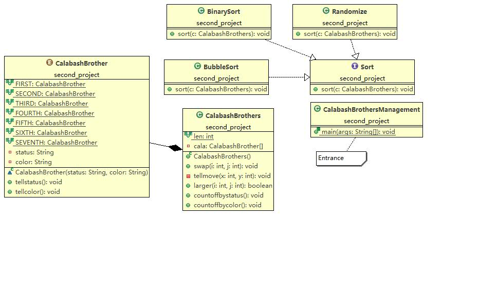

# 改进后的葫芦兄弟

----

## 主要思想

> * 分为三个大类，葫芦兄弟，葫芦兄弟队列，排序
> * 葫芦兄弟类有其排行，颜色属性，使用枚举类型将这两个属性绑定在一起，可以'talk'其排行，颜色
> * 葫芦兄弟队列类维护一个有7个葫芦兄弟的队列，负责指挥葫芦兄弟两两交换，报数，对葫芦兄弟比较大小等
> * 排序大类有三个类，冒泡排序，二分排序，随机化排序

----

### 葫芦兄弟类

> 葫芦兄弟有两个属性，排行和颜色，将其定义为枚举类型，并且将排行和颜色这两个属性绑定在一起，一旦定下来就不允许外界修改，因此让其定为私有属性。
```java
enum CalabashBrother{
	FIRST("老大","红色"),SECOND("老二","橙色"),THIRD("老三","黄色"),FOURTH("老四","绿色"),FIFTH("老五","青色"),SIXTH("老六","蓝色"),SEVENTH("老七","紫色");
	private String status;
	private String color;
}
```
报出自己的排行、颜色
```java
public void tellstatus() {
		System.out.print(status);
	}
	public void tellcolor() {
		System.out.print(color);
	}
```

-----

### 队列类

> 队列类在创建对象时就要初始化7个葫芦娃，这个数量应该要不允许更改，单个葫芦娃也不允许外界更改。因为是葫芦娃队列，让葫芦娃按照指令进行移动、报数、报告位置更改、比较两个葫芦娃的大小顺序是这个类该有的方法。
```java
public static final int len=7;
private CalabashBrother[] cala=new CalabashBrother[len];
public CalabashBrothers() {
		for(int i=0;i<len;i++)
			cala[i]=CalabashBrother.values()[i];
}
public void swap(int i,int j);      //交换两个葫芦娃
private void tellmove(int x,int y); //报告位置的移动
public boolean larger(int i,int j); //比较两个葫芦娃的大小
public void countoffbystatus();     //按照排行报数
public void countoffbycolor();      //按照颜色报数
```

----
### 排序类

> 这个大类应该实现指挥葫芦娃如何移动、如何排序的功能。冒泡法排序、二分法排序、随机化占位都具有指挥葫芦娃移动的功能。将这个特性抽象出来作为一个interface Sort,三个类分别implements Sort来具体实现排序的功能。

```java
interface Sort{
	public void sort(CalabashBrothers c);
}
class BubbleSort implements Sort{...}

class BinarySort implements Sort{...}

class Randomize implements Sort{...}
```

