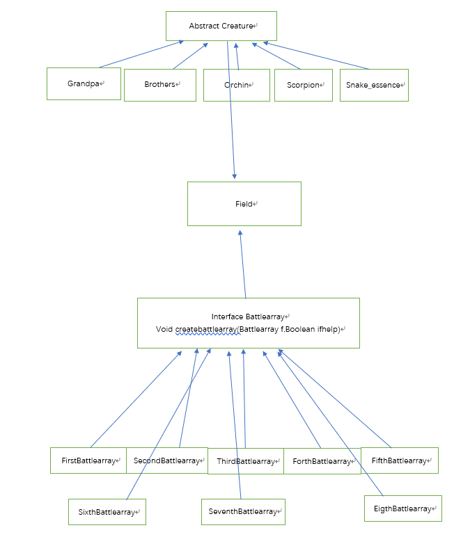

# **设计理念**
## **对象**
### 对战的生物体，抽象为虚类Creature
### 作战场地抽象为Field
### 战阵抽象为Battlearray，然后通过该接口在分为其他的战阵
### 具体的类间关系：

# **面向对象机制**
## **封装**
### 对几个战阵进行封装，隐藏了战阵的位置x,y以及每个位置上的Creature

## **继承**
### 每个生物体继承了虚类Creature

## **多态**
### 战阵是多态结构