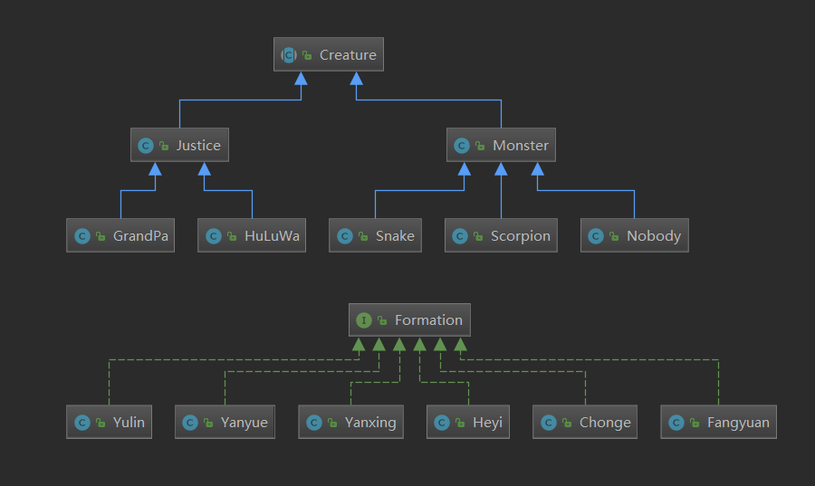

# Homework3_V2

##### 161210005 何峰彬

## 类图



## 更新

1.  将正义阵营和邪恶阵营分离为**Justice**和**Monster**，因为两方阵营的行为并不相同，所以将它们进行区分是有必要的。

2.  将**Position**和**Creature**解耦合，现在**Creature**类中不再包含**Posiontion**对象，更加符合SOLID设计原则。
    由于现在**Creature**中不再包含位置信息，所以对某个生物进行与位置有关的操作（如移除操作）等只能通过**Position**进行，但这些操作往往是和具体的生物类型相关的，所以使用了RTTI进行判断
    ```java
    private void clearMonsters(){
        ...
        Creature creature = positions.get(i).get(j).getObject();
        if(creature != null
           && !creature.getClass().equals(Snake.class)
           &&creature.getClass().getSuperclass().equals(Monster.class))
                positions.get(i).get(j).clear();  
        ...
    }
    ```

3.  将**Position**改为泛型类，现在**Position**上的物体不再局限于**Creature**，使其更接近现实意义上的位置，也提高了代码的可复用性。
    ```java
    public class Position<T>{...}
    ```

4.  使用**Collection**，原来BattleField中的数组均改为了List
    ```java
    List<List<Position<Creature>>> positions = new ArrayList<>();
    List<HuLuWa> huLuwas;
    List<Monster> monsters = new ArrayList<>();
    ```
    
5.  原来的阵型是作为BattleField的方法存在的，现在将其和**BattleField**解耦，并抽象出一个泛型接口**Formation**
    ```java
    public interface Formation<T>{
        void arrange(BattleField bf, T... objs);
    }
    ```
    由于目前仅限怪物方能进行排兵布阵，所以现在的各个具体的阵型定义如下
    ```java
    public class Heyi implements Formation<Monster>{...}
    public class Yanxing implements Formation<Monster>{...}
    ...
    ```
    

# Homework3_V1

##### 161210005 何峰彬

## 面向对象思想

### 继承
Creature为生物类的基类，有许多子类，包括HuLuWa, Snake, Scorpion等等，它们都有一些共有的方法，比如getPosition, setPosition, toString等，于是将这些方法放在基类中，采用继承的方法极大减少了代码的冗余，提高了代码的复用程度。
并且这些子类都重写了toString()方法，可以很方便地得到某个生物的字符串表示，而不必关心具体是哪个生物

### 抽象和封装
抽象是贯穿全局的一个概念，BattleField类作为战场，是程序开始的地方，Creature则代表着各种各样的生物，Zhenfa代表着各种阵型并对外提供统一的接口，它们都隐藏了底层的实现，限制了对私有成员的访问，有利于代码复用

### 单实例
蝎子精、美女蛇、爷爷这三个类只有一个实例，这是一种常用的设计模式，虽然在这个作业里好像并没有什么用...
