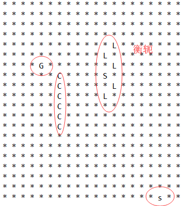

# 作业：面向葫芦娃编程
# 一、物体
物体有自己在场地的坐标(x,y)
## 生物
生物是物体的继承类，除了有坐标外，还有攻击力、防御力和血量三个生物属性。\
生物分为两个阵营，一方是**葫芦兄弟阵营**，另一方是**妖怪阵营**。\
生物有两种，一种是能够**直接进行攻击的生物**，包括葫芦娃、蝎子精和小喽啰；另一种是不能攻击，但当其在场上时，能够**对本阵营产生正面buff、对敌对阵营产生负面buff**，包括爷爷和蛇精两种。
#### 1、葫芦娃🐸
*葫芦娃*是*葫芦兄弟*阵营的主力输出，具有高攻击力和较高的防御力。每个*葫芦娃*还根据自身特点附带技能，**老大**力大无穷，攻击易*暴击*，**老二**千里眼顺风耳，*命中率*和*闪避率*高，**老三**铜头铁臂，钢筋铁骨，有几率*反弹攻击*，**老四**会玩火，攻击附带*持续灼烧伤害*，**老五**会玩水，攻击附带*持续冰冻伤害*，并能够*降低命中者攻速*，**老六**会隐身术，攻击有几率触发*刺杀*，直接杀死被命中者，**老七**有宝葫芦，攻击有几率触发*我叫你一声你敢答应吗*技能，触发后将敌方单位吸入葫芦，基础时间为2秒，受buff影响。\
尽管*葫芦兄弟*天生就有高额攻击和防御，但都是小孩子，受*爷爷*影响大，如果***爷爷*阵亡**，则*葫芦兄弟*技能就失去作用，如果*蛇精*在场，*老七*会受其*蛊惑*，变为*妖怪阵营*成员，同时随机对除自身外在场的一名*葫芦娃*使用*我叫你一声你敢答应吗*技能。
#### 2、爷爷👴
*爷爷*年老体衰，攻击力与防御力是所有生物中最低的。*爷爷*在场时，*葫芦兄弟*的特殊技能全部生效。\
*爷爷*唯一的技能是*浇水*，每3秒恢复场上每个*葫芦娃*5%的*生命值*
#### 3、蝎子精🦂
*蝎子精*作为肉体最强生物，拥有远高（<300%）于其他生物的攻击力、防御力和血量。\
*蝎子精*的技能为*振奋*，每三次攻击产生一次*暴击*。
####4、蛇精🐍
*蛇精*没有攻击力，防御力与血量一般。\
*蛇精*的技能为*魅惑*，*精神冲击*和*舍人为己*。*魅惑*能够使对方精神错乱攻击友军，*精神冲击*能够使对方精神错乱不能攻击，二者的持续时间都为1秒钟，二者同属精神类攻击，当*爷爷*在场时不能产生效果。*舍人为己*随机选定一名*小喽啰*，替*蛇精*承受一次攻击，本次攻击中，*蛇精*不受伤害，*小喽啰*受到120%的伤害
####5、小喽啰🕷🦇
攻击力防御力弱，炮灰，没有技能。
## 攻击波
生物攻击时，会发出攻击波，攻击波在场地中飞行，每秒飞行一距离。遇到第一个敌人时产生效果并结束。
# 二、场地
## 区域
作战场地为默认为20\*20的正方形，初始时，葫芦兄弟阵营站在左侧20\*10的矩形中，妖怪阵营站在右侧，当战斗开始时，两阵营人物可在整个阵地（包括己方和对方阵地）上自由走动。
## 阵型
作战前首先要摆放阵型。每个阵营只能在自己的阵地摆放阵型，每个阵型将占有能够容纳它的最小的矩形，例如鹤翼阵需要占用7*4大小的矩形。\
摆放时，接收一个坐标输入(x,y)，指示上述矩形的左上角位置，根据左上角位置和矩形大小判断能够在本阵营区域摆放阵型。
#### 1、葫芦兄弟
葫芦兄弟只有一个阵型——长蛇阵，爷爷自己一个阵型，可以摆放在任意位置（如果你不想他死那么快就请把他放在葫芦娃身后）
#### 2、妖怪
妖怪有八种阵型——鹤翼、雁行、衡轭、长蛇、鱼鳞、方门、偃月和锋矢。其中蝎子精处于阵型最中央，身先士卒，勇气可嘉，阵型的其他位置都是小喽啰。蛇精也可以摆放在场地的任何位置（同样的如果你不想她死那么快就请把她放在妖怪们身后）
## 摆阵
**葫芦兄弟**团结一线，总是摆出一字长蛇阵，共同面对敌人，将葫芦七兄弟按照作业二排序后，随机生成一个葫芦兄弟阵地的坐标，检测从该坐标起向下沿伸（沿x坐标增大的方向），如果能放下，则将葫芦兄弟放置在战场上，否则再次生成随机坐标，重复上述步骤。
**爷爷**在葫芦兄弟上场后登场，随机生成一个葫芦兄弟阵地的坐标，检测该位置，如果没有葫芦娃，则在此放下爷爷，否则重新生成随机坐标，重复上述操作。
**蝎子精**带领**小喽啰**先排阵型。随机选择一个阵型后，生成相应数量的蝎子精和小喽啰，按照阵型个体摆放顺序放置在一个向量Vector中，之后随机生成一个妖怪阵营阵地的坐标，检测以该坐标为阵型所占最小矩形的左上角，能否在阵地中放置该阵型，能容纳则摆放该阵型，如果不能则重新生成随即坐标重复上述步骤。
**蛇精**的放置方式与**爷爷**相同，不做赘述。
## _作业三_
按照上述步骤在阵地中摆放好两阵营人物后，输出阵地情况，阵地中空位用*表示，葫芦兄弟用C表示，爷爷用G表示，小喽啰用L表示，蝎子精用大写S表示，蛇精用小写s表示。如下是某次程序运行结果。

# 三、GUI
# 四、Multithreading
# 五、类及类间关系
#### package Beings
Beings.java
```javascript
package Beings;

//本类是生物和攻击波的父类
public class Beings {
    //坐标
	protected int x, y;
	//移动
	public void MoveToPos(int x, int y)
}
```

Creature.java
```javascript
//本类是葫芦娃、爷爷、蝎子精、蛇精、小喽啰的父类，是Beings的派生类
package Beings;
public class Creature extends Beings{
    //攻击力Combat Effectiveness
	protected int CE;
    //防御力Defence
	protected int DEF;
    //血量Health Point
	protected int HP;
    //buff状态
	protected boolean Motivated;
    //存活状态
	protected boolean livingStatus;
    //取攻击力
    public int getCE(int radio);
	//取防御力
    public int getDEF();
	//取血量
    public int getHP();
    //取buff状态
	public boolean isMotivated();
    //取存活状态
	public boolean isLiving();
    //设置buff状态
	public void setMotivated(boolean Motivated);
    //攻击
	public void Attack(Creature attackedBeing,int radio);
}
```

CalaBashBrother.java
```javascript
package Beings;
enum NameAndColor {//
	RED, ORANGE, YELLOW, GREEN, CYAN, BLUE, PURPLE;
	String[] NAME = {"老大", "老二", "老三", "老四", "老五", "老六", "老七"};
	String[] COLOR = {"赤", "橙", "黄", "绿", "青", "蓝", "紫"};
	//取名字
    String getName() ;
	//取颜色
    String getColor();
}
public class CalabashBrother extends Creature{

	private NameAndColor nc;
    //默认构造函数
	CalabashBrother();
    //带参构造函数
	CalabashBrother(NameAndColor NC);
	CalabashBrother(int x, int y);
	CalabashBrother(int x, int y, NameAndColor NC);
	//取名字
    public String getName();
	//取颜色
    public String getColor();
	//设置颜色和名字，对应上面的enum类型
    public void setNameAndColor(int index);
    //比较函数，用于作业二排序
	public int compareTo(CalabashBrother brother);
}
```

CalabashBrothers.java

```javascript
package Beings;
public class CalabashBrothers {
    //七个葫芦兄弟
	private CalabashBrother[] calabashbrothers;
    //默认构造函数
	public CalabashBrothers();//设置位置
	public void SetCBPostion(int index, int x, int y);
	//作业二排序交换位置
	public void SwapBrother(int index1, int index2);
    //取index位置的葫芦娃
	public CalabashBrother getBrother(int index);
    //取index位置的葫芦娃的名字
	public String getName(int index);
    //取index位置的葫芦娃名字
	public String getColor(int index);
    //作业二输出当前葫芦兄弟队的情况
	public void QueueNameStatus();
	public void QueueColorStatus();
    //作业二打乱葫芦兄弟队伍
	public void Disorder();
}

```

GrandPa.java
```javascript
package Beings;
public class GrandPa extends Creature{
	//构造函数
	public GrandPa();
}
```

Scorpion.java
```javascript
package Beings;
//蝎子精
public class Scorpion extends Creature{
	//构造函数
	public Scorpion();
}
```

Snake.java
```javascript
package Beings;

public class Snake extends Creature{
	//构造函数
	public Snake();
}

```

LouLuo.java
```javascript
package Beings;
public class LouLuo extends Creature{
	//构造函数
	public LouLuo();
}

```
#### package BattleField
BattleField.java
```javascript
//泛型，可存放所有物体
package BattleField;
import Beings.*;
public class BattleField<T extends Beings> {
    //本块场地中的物体
	private T Being;
    //默认构造函数
	BattleField();
    //带参构造函数
	BattleField(T t);
    //查看格子是否为空
	public boolean isEmpty()；
    //取得本格子上的物体
	public T getBeing()；
    //把格子上的物体移走
	public T removeBeing()；
    //在格子上放上物体。已内嵌removeBeing方法
	public boolean setBeing(T t)；
}
```

BattleFields.java
```javascript
package BattleField;
import java.util.*;
import Beings.*;
public class BattleFields {//战场为M*N的矩形
    //场地长
	private int M;
	//场地宽
    private int N;
    //场地
	private  BattleField BFs[][];
    //默认构造函数
	public BattleFields();
    //带参构造函数
	BattleFields(int m, int n);
	//初始化场地。实际上就是将所有格子都赋空指针
	public void initializeBattleField();
    //作业三，场地能否容纳阵型
	public boolean Containable(int x, int y, int length, int height);
    //在战场(x,y)位置放置物体t
	public boolean SetBFPosition(int x, int y, Beings t);
	//输出战场情况
	public void BFOutput();

}
```
#### package main
Director.java
```javascript
import java.lang.*;
import java.util.*;
import BattleField.*;
import Beings.*;
import java.util.concurrent.*;
public class Director {
	//战场
	private BattleFields BFs;
	//葫芦兄弟们。这个对象实际上已经没有用了，是作业二的遗产代码
	private CalabashBrothers CBs;
	//默认构造函数
	Director()；
	//带参构造函数
	Director(BattleFields bfs)；
	//带参构造函数
	Director(BattleFields bfs, CalabashBrothers cbs)；
	//在某位置摆放。两个重载，第一个是摆放爷爷和蛇精，第二个是摆放葫芦兄弟和蝎子精与小喽啰们，他们储存在Vector向量中
	public boolean setFormation(int x, int y, int biasY, Creature t)；
	public boolean setFormation(int x, int y, int biasY, String formationName,Vector<Creature>list)；
	
	//输出名字状态。两个重载
	public void QueueNameStatus()；
	public void QueueNameStatus(CalabashBrothers calabashbrothers)；
	
	//输出颜色状态。两个重载
	public void QueueColorStatus()；
	public void QueueColorStatus(CalabashBrothers calabashbrothers)；
	
	//冒泡排序。两个重载
	public void BubbleSort();
	public static void BubbleSort(CalabashBrothers calabashbrothers);
	
	//快速排序。两个重载
	private int Partition(int p, int r);
	public void QuickSort(int p, int r);
	
	private static int Partition(CalabashBrothers calabashbrothers, int p, int r);
	public static void QuickSort(CalabashBrothers calabashbrothers, int p, int r);
	//将葫芦娃的顺序打乱
	public void Disorder();
	public CalabashBrother getBrother(int index);
	//显示战场情况
	public void showBF();
	//清空战场
	public void clearBattleField();
	//主函数
	public static void main(String[] args);
	
}
```
#### package Randomnum
```javascript
import java.util.Random;
public class Randomnum {
	//Random类。只在第一次初始化
	static Random r = new Random();
	//产生一个在[0,upline)范围内的随机整数
	public static int getRandom(int upLine);
}
```