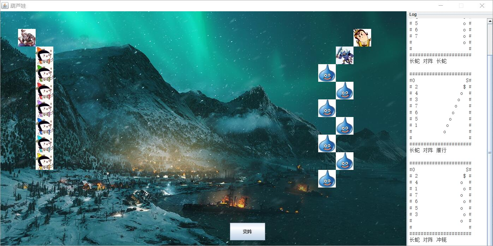

# 思路（文件划分）

### 单个生物体类 Creature

存放生物体的共同基本信息，如名称、坐标、字符表示、存在情况等。

其子类为：

- CalabashBrother，葫芦娃，比其他生物体多一个int变量表示序号
- GrandFather，老爷爷
- ScorpionMonster，蝎子精
- SnakeMonster，蛇精
- SmallMonster，小妖怪

其主要方法为：

- set，置exist为true并赋值到生物体的坐标，但此时并不在棋盘上放置该生物

### 多个生物体类 Creatrues

对生物群整体进行排序和站队。

其中包含：

- 一个Creature数组
- 阵型f

其子类为：

- CalabashBrothers，包含hw2中的乱序、排序等方法
- Monsters

其主要方法为：

- set/reset，根据阵型放置已有生物群/重置生物群

### 阵营类 Camp

将所有生物分为好人和坏人两个阵营。

其中包含：

- boss，表示老大的单个生物体类
- soldiers，表示一堆小兵的多个生物体类

### 棋盘类 Board

在二维空间中放置生物体。

其主要方法为：

- set & reset，基于给定坐标放置/重置生物体
- test，检查指定坐标是否有生物存在

### 阵型类 Formation

检查阵型的合理性及按阵型放置生物群。

其子类为：

- Snake
- Goose
- Yoke
- Crane
- ……

其主要方法为：

- test，检查阵型中每个生物体是否都可以放置
- set，基于阵型放置生物体群

### 图形界面类 Display

利用Java Swing创建了图形界面。

其中包含：

- frame，“画板”
- panel，“画布”
- 若干label，与生物体一一对应，通过移动label在panel中的坐标实现生物图片位置的变化
- button，通过点击按钮实现阵型的变化
- textPane，文本区域，打印结果
- scrollPane，滑动区域，将文本区域放在其中
- 一个用于加载背景的label

### 上帝类 God

创建各类的对象并进行整体调度。

其中包含：

- 一个棋盘
- 阵型集合
- 好人阵营与坏人阵营
- 图形界面实例

### 主类 Main

创建一个上帝，让上帝跑起来。此外不承担具体工作。

# 面向对象的理念体现

- 生物类、生物群类和阵型类均利用了继承机制，其变量均定义为protected，在保留父类的基本性质下，可以自由地增添修改新的变量和方法，为以后扩展留下空间。
- 生物群类的默认构造函数为空，在每个子类内具体实现。
> 原因是父类保护变量Creature数组没有具现化，既不知道长度也不知道每一位是哪个生物，而子类的构造函数带一个number参数。如在CalabashBrothers子类中，实现为7个CalabashBrother类；在Monsters子类中，实现为1个ScorpionMonster类和number-1个SmallMonster类。

- 阵型类中，将阵型的几何性质封装到方法内部，使得测试方法只需要知道初始点坐标和生物数量，即可判断对应的阵型是否可以放置。
- 棋盘类中，每一个点初始化为父类生物，不具体实现只将exist置为false。

# 结果展示
如图所示，实现了简单的图形界面，通过按钮操作实现妖怪群体的变阵，并且在右侧文本区域输出了原先的控制台结果。

# 一些存在的问题

- 所给的八个阵型中，除已经实现的四个（长蛇、雁行、冲轭、鹤翼），剩下四个没有明显的规律。或者说，只有特定数量的生物才能摆出相应的形状，如果传入任意数量的怪物，如战斗过程中怪物数量减少，可能不能摆出合适的阵型。
- 实现图形界面时，直接使用了swing中的组件和方法，但没有将自己的类作为frame类的继承，也没有引入graphic参数，以后可能会有一些实现困难。（对java图形界面的理解尚浅）
- 对于按钮操作的反馈，采用的是最简单的循环检测方法，以后功能增加可能会导致不便，考虑以后引入多线程解决。
- 阵营类Camp封装了生物体，目前有点意义不明。由于要直接访问其变量boss和soldiers，故只能设置为public变量。且Camp没有任何子类，目前也没有方法，可能以后会有用处吧。