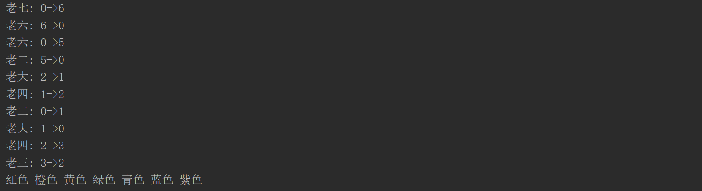

# Java 作业3说明文档
## 抽象世界描述
在我设计的世界中，有两种基本类型的元素，一种是生物元素，一种是环境元素。生物元素就是包括好人（*葫芦娃*、*爷爷*），坏人（*蛇精*、*蝎子精*、*小喽啰*）在内的各种生命体；环境元素就是*战斗本身*，*战场*，*排序器*，*阵型*等。好人和坏人阵营各有一个领导者，分别为爷爷和蛇精，由他们来指挥所属阵营生物的排兵布阵。其他生物在接到他们的指令后，便会主动移动到相应的位置上。初始时，葫芦娃兄弟在作业2中排序控制器的指挥下，按颜色排序。根据题目要求，好人阵营中葫芦娃的阵型不变，只有爷爷的位置会变，而坏人阵营中所有生物的位置都要变动，因此，我设计坏人在伪方阵（钻石阵）和衡轭阵间切换。
## 类说明
### 生物包(Package Creature)
1. **Creature**
描述普适性的生物概念，是所有生物元素的基类。
```
public class Creature {
    int x; //生物的x坐标
    int y; //生物的y坐标
    String sign; //生物的图示符号

    public Creature();

    public void display(); //打印生物的符号
    public void move(Battlefield world, int arg1, int arg2); //移动到战场上的指定位置

    public int getX(); //获取生物的x坐标
    public int getY(); //获取生物的y坐标
}
```
2. **CalabashBrother**
描述葫芦娃，除了继承自Creature类的属性外，还有位次和颜色两种重要的属性，用两种枚举类来描述，属性域见代码。
```
public class CalabashBrother extends Creature {
    Age rank; //葫芦娃的位次属性，Age是个枚举类，详见作业2说明文档
    Color colorAttr; //葫芦娃的颜色属性，Color是个枚举类，详见作业2说明文档

    public CalabashBrother (int n); //根据参数给出的编号，来创建对应位次和颜色的葫芦娃对象

    public int compareAge(CalabashBrother right); //依据位次属性进行排序
    public int compareCol(CalabashBrother right); //依据颜色属性进行排序

    public void displayMov(int src, int dst); //打印移动过程
    public void moveTo(CalabashBrother[] queue, int index); //在葫芦娃的排序队列上移动到指定位置
    public int getNum(); //获取葫芦娃的位次

    public void printAge(); //打印葫芦娃的位次信息
    public void printCol(); //打印葫芦娃的颜色信息
}
```
3. **Monster**
描述蝎子精、小喽啰等具有战斗属性的坏人，除了继承自Creature类的属性外，还有名称属性。
```
public class Monster extends Creature {
    String name; //名称属性

    public Monster(String argName, String argSign); //用于初始化一个坏人的信息
}
```
4. **Leader**
描述两方的领导者——爷爷和蛇精，除了继承自Creature类的属性外，还有身份属性（枚举类型属性），以及自己的战略库（一个用于储存阵型的可变长向量）和当前采用战略的指针。身份属性用LeaderEnum枚举类型来描述，从而限制属性域。如果在构造Leader时，传入了一个非法的名称，则初始化成特定的“空实例”，并触发警告。
```
public class Leader extends Creature {
    Vector strategies; //战略库
    int nowPtr; //当前采用战略的指针
    LeaderEnum id; //身份属性

    public Leader(String argName); //构造函数，按名构造，sign在枚举类型构造时指定，此处只是读取

    public void addFormation(Formation fm); //向战略库中添加阵型
    public void addFormation(File fp); //从文件中导入阵型
    public void embattle(Battlefield world, Creature[] kids); //排兵布阵，安排阵营中生物的位置（包括自身）
}
```
### 环境包(Package Environment)
1. **Game**
描述整个程序的主体——游戏。
```
public class Game {
    public static void main(String[] args); //启动游戏，也是整个游戏程序的main方法
    static void initializeFormation(Leader snaker, Leader grandpa);
    //为两位领导者初始化阵型。在此处，我分别试验了使用相对路径和使用java资源管理器两种方式来从txt文本文件中导入阵型信息
    //配置文件为放在res包下的monsterFormationConfig.txt和huluwaFormationConfig.txt
}
```
2. **Battlefield**
描述大环境——战场，其本质是一个2维空间，每个位置上均可以放置一个生物。
```
public class Battlefield {
    Position<Creature>[][] matrix; //二维空间
    final int size; //空间在单个维度上的大小

    public Battlefield(int sz); //初始化战场的空间，sz指导大小

    public void setCreature(Creature object); //在战场上放置生物一个，位置由生物本身的位置属性决定（x，y坐标）
    public Creature getCreature(int x, int y); //获取指定位置上的生物
    public void clear(int x, int y); //代表该位置上原有的生物离开该位置

    public void print(); //打印整个战场上的形势：对于生物，打印其图示符号；对于没有生物的位置，打印空格。
}
```
3. **Position**
描述环境中的一个位置，其类型参数用于指定其可以承载什么类型的物体，其边界类型为Creature，即只能承载生物。
```
public class Position <T extends Creature> {
    T conetnt = null;

    public T getConetnt(); //获取其承载的物体

    public void setConetnt(T conetnt); //设置其承载的物体
}
```
4. **Formation**
描述阵型，其所含的信息包括领导者的位置和部下们的位置。
```
public class Formation {
    final static int num; //阵型所包含的部下的数量
    final static int dimension = 2; //阵型中每个坐标的维度
    String name; //阵型的名字
    int[] leaderPos; //领导者的位置
    int[][] array; //部下们的位置

    public Formation(int[][] arg, String str, int[] argLeaderPos); //初始化阵型的信息
    static public int getSize(); //获取阵型的大小信息
    static public int getDimension(); //获取坐标的维度
    public int[] getCoord(int n); //获取阵型一个指定单位的位置信息
    public int[] getLeaderPos(); //获取领导者的位置信息
}
```
5. **SortController**
描述排序器，是作业2中的简化版本。采用快速排序算法，基于葫芦娃的颜色属性进行比较，会输出排序中的位置变动信息及结果。
```
public class SortController {
    //Sort Calabash Brothers by Quick-sort Algorithm based on color
    public static void sort(CalabashBrother[] huluwa); //排序主方法

    //Execute a recursion process
    private static void quickSort(CalabashBrother[] huluwa, int start, int end); //快速排序过程
}
```
## 运行截图及解析
为了美观，我没有使用汉字来代表各个生物，而是使用ASCII字符，'1'~'7'代表7个葫芦兄弟，'$'代表爷爷，'&'代表蛇精，'@'代表蝎子精，'*'代表小喽啰。
- 排序及游戏启动截图
 
- 阵型持续变化效果截图
