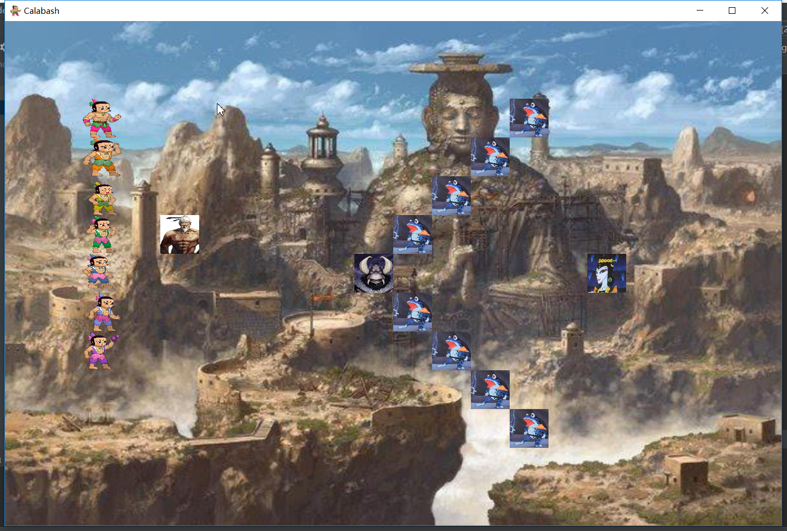
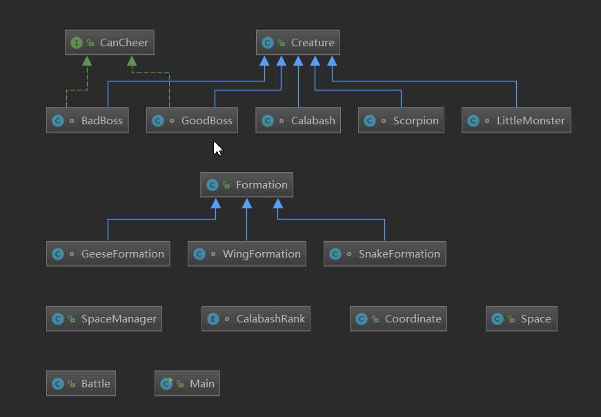

# 第三次作业更新2.0：重构代码，添加GUI

使用GUI框架为javafx，运行效果：
（单击鼠标切换喽啰阵型）


类间关系如下：




Formation类：其中包含了一个由Coordinate类型元素组成的动态数组，

Space类：记录战场信息，包括战场的大小，每个位置上的生物。并加入ImageView类的数组，用于GUI显示

SpaceManager类：控制生物体进出战场，改变生物体位置

Battle类：实现战场信息的改变更新

Main类：继承Application，控制主窗体的显示。


# 第三次作业更新1.0

## 改善了代码文件布局
### 将原来单个java文件拆分为多个java文件
## 修改了类的实现及类之间的关系
### 修改前，Grandpa和Snake是Creature的两个子类，修改后GoodBoss和BadBoss为Creature的两个子类，grandpa和snake分别为GoodBoss和BadBoss的实体
### 修改前，阵型Formation原先通过枚举类实现，并且在其中有ArrayList类型的成员用于记录构成这个阵型的实体，并且一种阵型成员的数目是固定的。修改后，编写基类Formation，其中只包含记录各成员位置信息的动态数组pattern，不同的阵型如SnakeFormation、WingFormation都继承Formation类，在其构造器中根据传入的参数生成位置信息

```
public class Formation{
    ArrayList <Coordinate>pattern;
    Formation(){
        pattern = new ArrayList<>();
    }
}
class SnakeFormation extends Formation{
    SnakeFormation(int num){
        for(int i=0;i<num;i++)
            pattern.add(new Coordinate(i,0));
    }
}
```


# 第三次作业

### Creature类
空间中每个坐标处都可以存在一个生命体，葫芦娃、爷爷、蝎子、蛇精、小喽啰都属于生命体，因此可以让他们分别继承Creature类
```
class Creature{...}
class Calabash extends Creature{...}
class LittleMonster extends Creature{...}
class Scorpion extends Creature{...}
```
考虑到爷爷和蛇精都有加油这个方法，但各自加油方式不同，编写CanCheer接口
```
interface CanCheer(){...}
class Grandpa extends Creature
    implements CanCheer{...}
class Snake extends Creature
    implements CanCheer{...}
```


### Formation枚举类
Formation类中记录了阵型长、宽、组成阵型所需实体数量，并用数组形式记录了阵型式样（即各实体成员的相对位置），同时还包含一个由组成该阵型成员构成的动态数组
操控者在在放置阵型时，根据阵型的绝对位置和其中成员的相对位置，将实体放置于空间特定坐标处


### Manipulator类
操控者，负责各个生物体的创造、排序、放置、移除
```
class Manipulator {
    Scorpion CreateScorpion(){...}
    LittleMonster CreateLittleMonster(){...}
    Grandpa CreateGoodBoss(){...}
    Snake CreateBadBoss(){...}
    Calabash[] CreateCalabashBrothers(){...}

    void Swap(Calabash[] brothers,int i,int j){...}
    void CalabashSort(Calabash[] brothers){...}
    void PlaceCharacter(Space bf, Creature c, int x, int y){...}
    void RemoveCharacter(Space bf, Creature c){...}
    void PlaceFormation(Space bf,Formation f,int x,int y){...}
    void RemoveFormation(Space bf, Formation f){...}
}
```


### Space类
其中包含了二位数组map记录地图信息
Display()方法输出地图信息


