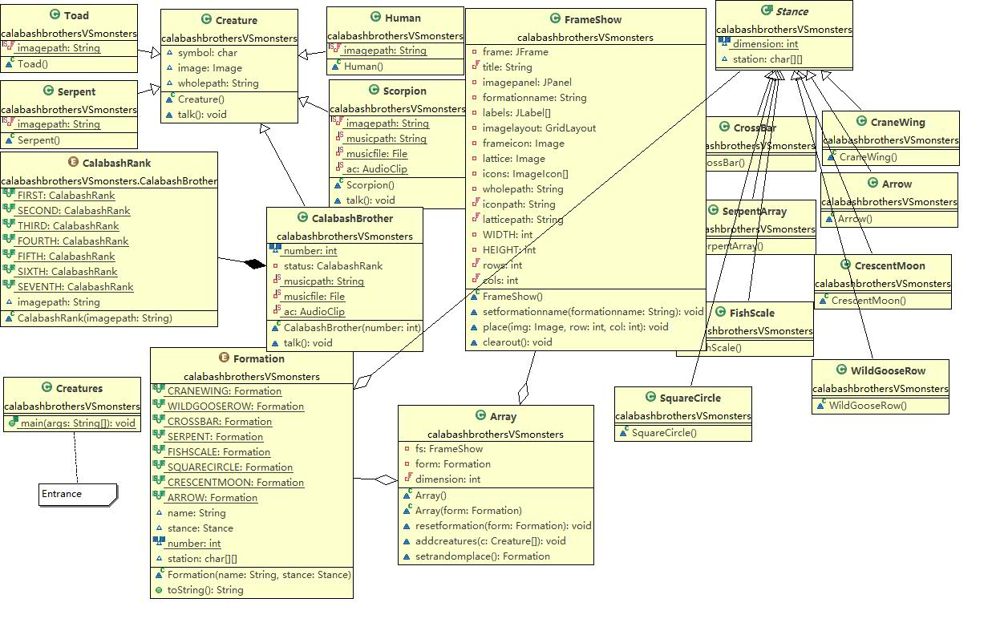

# 葫芦娃大战妖精_RTTI,collection

#### 相较于第一个版本的改进

* 使用了ArrayList来存放管理创建出来的生物，而不是单独的一个个生物
* 基本上每个类单独一个文件，便于管理
* 受到大佬的启发，为便于扩展其他非生物增加了Creature的基类Being。在Creature下面又分为了Good和Bad。在Bad下面除了蛇精和蝎子精之外定义了Follower这个抽象类，含义是"小喽啰"，在Follower下面是各种具体的小喽啰。由于所有的Being都可能会有“行为”，定义了Behave这个接口，Being实现此接口，CheerUp接口和Battle接口分别继承Behave，各自被有需要的类实现。
* 仍然使用图形界面，但较于第一个版本更好看，可以自己选择阵形，也可以点击生物，会实现各自的行为(目前都是在控制台输出一段话)。
* 设置Cell类，该类继承自JButton作为阵形中的一个小格子，Cell类不可以放任何Being，只是作为战场的一部分存在。BeingCell继承Cell，可以放任何Being。其余的类和继承关系类似于beings包中的情况。每个Cell只允许放置该类对象或者子孙类对象(使用了RTTI    Class对象)BeingCell添加了事件处理，当点击BeingCell时，如果上面放置了Being，就会调用Being的Behave().
* 设置Formation类，该类含有15*15个Cell，各种具体的阵形继承自Formation创建不同的Cell子类对象。
* 设置BattleField类，该类继承自JPanel，数据成员含有一个Formation。
* 主界面类也承包了创世界的功能，先创造各Being，再创造用户交互的界面。


#### 类结构

beings包

- 


cells包


formation包


效果展示：


上面一排是being show，展示都有哪些being参与。

左边的下拉框可以选择阵形。

中间面板的按钮可以点击，如果上面放置了生物则会有相应的行为(目前是在控制台打印出一段话)。


编译后将additions文件夹跟其他class文件所在包文件夹放在同一目录下。


# 葫芦娃大战妖精_v1

---

## 用简单图形界面展现葫芦娃与妖精的对战

> * 涉及到三种类：生物、阵列和界面
>
> * 生物包括葫芦娃、爷爷、蛇精、蝎子精、小喽啰，他们有其共性，且为了便于其他类对生物进行统一处理，定义基类Creature，各生物继承该类。
> * 阵列有且仅有8种，用二维字符矩阵表示阵列，不同的字符代表不同的生物。除了8种阵列名字是枚举的，8种二维矩阵也应该是枚举的。仿照各种生物，将各种二维矩阵定义成一个基类和8个继承类的关系。基类Stance含有一个全为0的二维矩阵，不用来实际创建对象，定义为抽象类。用枚举类型Formation将阵列名字和各阵列对象绑定在一起。
> * 界面用一个窗体承载，将窗体中的内容划分成二维矩阵，可以将生物放到指定位置
> * 不直接使用界面类、阵列类，而是将其聚合在另一个类中提供给用户使用


### 类介绍

#### * Creature

数据成员

- [x] 图片对象
- [x] 在阵列上所代表的字符
- [x] 读取图片的路径字符串

```java
char symbol;
Image image;
String wholepath;
```

方法

- [x] 构造函数读取工程目录
- [x] talk()方法播放音乐(函数体为空，不是每一种生物都需要播放音乐)


#### * CalabashBrother

数据成员

- [x] 内部定义枚举类型，枚举排行所对应的相对图片路径

- [x] 固定的不可更改的葫芦兄弟的数量
- [x] 音乐文件的路径
- [x] 音乐文件
- [x] 播放音乐的对象(类似于生物的声带)

```java
enum CalabashRank{
    FIRST("\\c1.jpg")\\...SEVENTH("\\c7.jpg");
    String imagepath;
}
static final int number=7;
private CalabashRank status;
private static String musicpath;       //
private static File musicfile;         //
private static AudioClip ac;           //一个类的所有对象只需要一个
```

方法

- [x] 构造函数    //读取音乐文件、图片
- [x] 重载talk()   //播放音乐


##### 其余生物类Human, Serpent, Scorpion, Toad与CalabashBrother类似，但只有CalabashBrother和Scorpion类可以播放音乐


#### * Stance类及其派生类

```java
static final int dimension = 13;  //矩阵宽度(高度)
char [][] station;                //各个位置存储相应的生物所代表的符号
```

派生类为**CraneWing**, **WildGooseRow**, **CrossBar**, **SerpentArray**, **FishScale**, **SquareCircle**, **CrescentMoon**, **Arrow**


#### * enum Formation

```java
CRANEWING("鹤翼阵",new CraneWing())//...ARROW("锋矢阵",new Arrow());
String name;
Stance stance;
static final int number=8;
Formation()                    //存储name和Stance
public String toString()       //将阵列名转换成中文名字
```


#### * FrameShow

成员

- [x] 窗体
- [x] 窗体标题
- [x] 窗体图标
- [x] 面板
- [x] 在窗体标题上显示的阵列名字
- [x] N*N个标签(用来承载生物图标)
- [x] N*N个生物图标
- [x] GridLayout布局
- [x] 空白格子图片
- [x] 各种图标图片的路径
- [x] 窗体的宽度、长度、行数、列数

方法

```java
FrameShow();  //进行初始化工作
void setformationname(String formationname);   //设置在窗体标题中出现的阵列名
void place(Image img, int row, int col);       //把指定图片放到指定位置
void clearout();                               //清空所有生物
```


#### * Array

成员

- [x] FrameShow对象fs
- [x] Formation对象form
- [x] 矩阵宽度(高度)

方法

```java
Array();                              //构造函数,初始化fs
Array(Formation form);                //构造函数初始化fs,设置阵列,在窗体中显示阵列名
void resetformation(Formation form);  //设置Formation,在窗体中显示阵列名
void addcreatures(Creature... c);     //将生物一个个添加到阵列中应该出现的位置上,并且在添加第一个生物时，调用其talk()播放音乐
Formation setrandomplace();           //返回一个除了长蛇阵列外的其他阵列    
```





