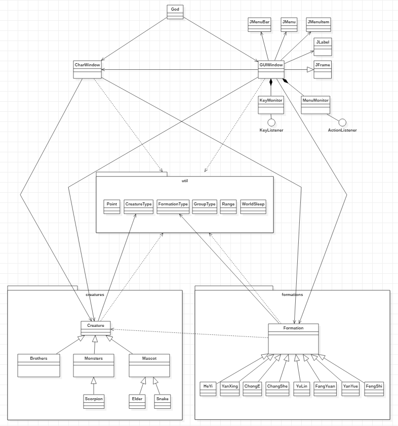
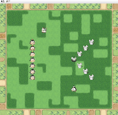
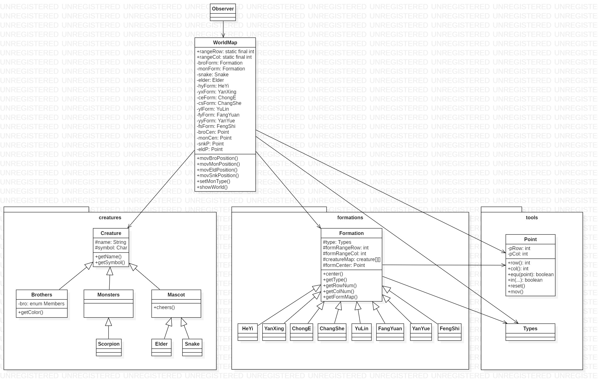
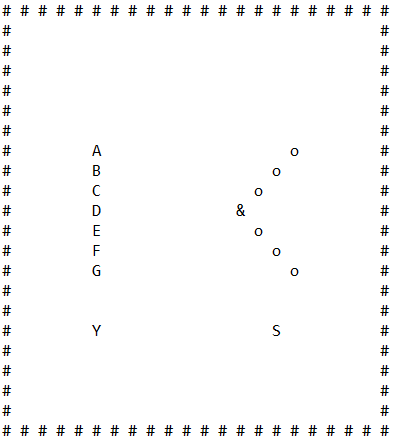
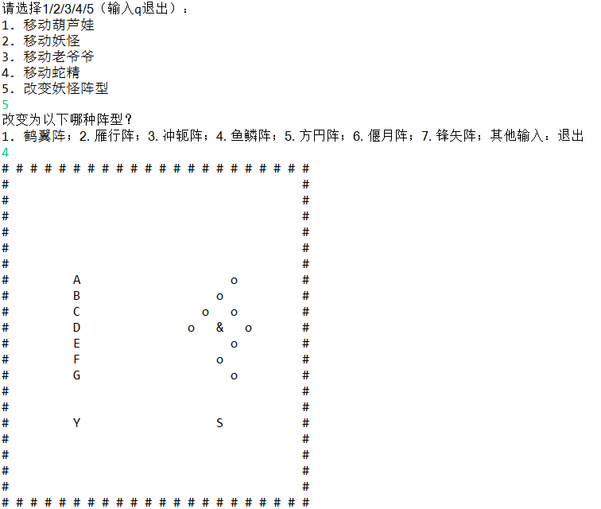
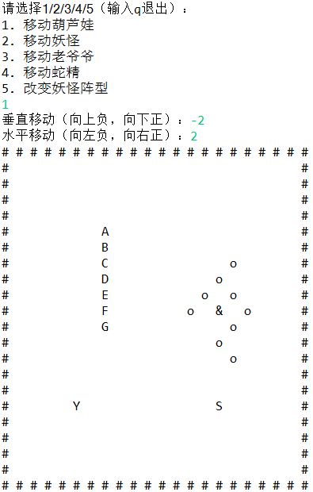
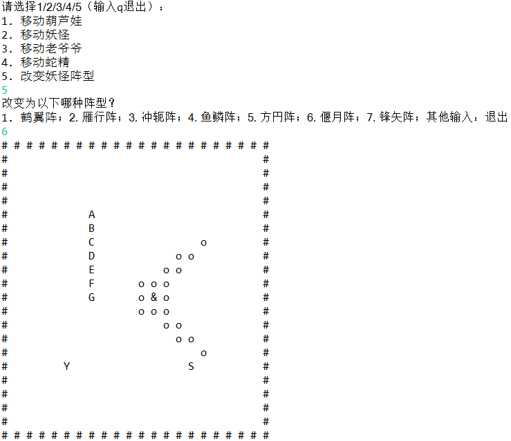
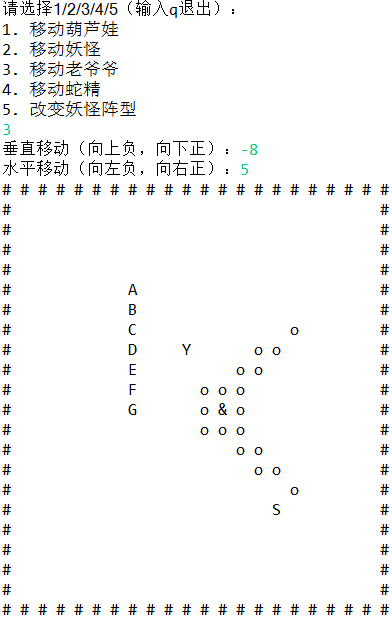
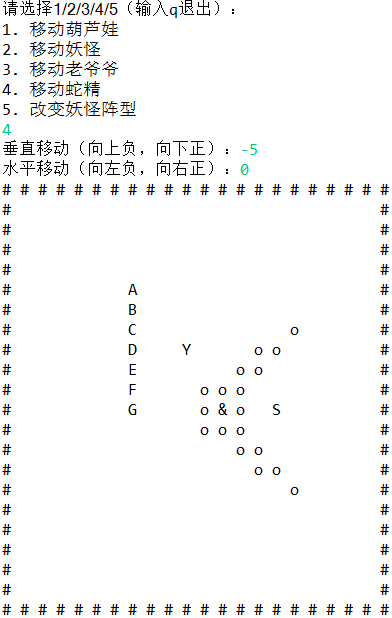

#
# World v3.1 版
- 当前版本
- 对 **Formation** 类添加泛型  
- 对 CharWindow 和 GUIWindow 中涉及 Formation 类的方法添加泛型  
- 对不会被继承的类添加了 final 关键字

## 详细说明（仅对修改3.0的部分进行说明）
### （一）Formation
Formation 类，一切阵型类的父类。由于阵型里有的放了葫芦娃（长蛇阵），有的放了妖怪（除了长蛇阵的其他阵型），为了直观，对 Formation 进行了泛型处理，受到影响的方法和变量如下： 
```java
public abstract class Formation<T extends Creature> {
    ...
    /** 阵型的 <位置，对象> 集合 */
    public Map<Point, T> formMap;
    /** 构造函数，在子类的构造函数中调用 */
    protected Formation(FormationType t, int r, int c, int cr, int cc) {
        type = t;
        formRowNum = r;
        formColNum = c;
        pFormCen = new Point(cr, cc);
        formMap = new HashMap<Point, T>();
    }
    /** 得到阵型在点p处的对象 */
    public T getCreature(Point p) {
        return formMap.get(p);
    }
    ...
}
```
既然父类被改变了，8个阵型子类也需要处理，以下妖怪阵型以鹤翼阵为例，其他同理：
```java
public final class HeYi extends Formation<Monsters> {
    public HeYi() {		
        super(FormationType.HY, 7, 4, 3, 2); // 以阵型图所占行列构建
        // 妖怪的位置
        formMap.put(new Point(0, 3), new Monsters());
        formMap.put(new Point(1, 2), new Monsters());
        formMap.put(new Point(2, 1), new Monsters());
        formMap.put(new Point(3, 0), new Scorpion()); // 蝎子精
        formMap.put(new Point(4, 1), new Monsters());
        formMap.put(new Point(5, 2), new Monsters());
        formMap.put(new Point(6, 3), new Monsters());
    }
}
```
同样，葫芦娃阵型的长蛇阵改变如下：
```java
public final class ChangShe extends Formation<Brothers> {
    public ChangShe() {		
        super(FormationType.CS, 7, 1, 3, 0); // 以阵型图所占行列等构建
        // 葫芦娃的位置
        formMap.put(new Point(0, 0), new Brothers(0));
        formMap.put(new Point(1, 0), new Brothers(1));
        formMap.put(new Point(2, 0), new Brothers(2));
        formMap.put(new Point(3, 0), new Brothers(3));
        formMap.put(new Point(4, 0), new Brothers(4));
        formMap.put(new Point(5, 0), new Brothers(5));
        formMap.put(new Point(6, 0), new Brothers(6));
    }
}
```

### （二）CharWindow
首先改变的是对象的实例化过程：
```java
    public Formation<Brothers> broForm; // 葫芦娃阵型对象
    public Formation<Monsters> monForm; // 妖怪阵型对象
```
随后参数或返回值上带有 Formation 类型（通常传的参数是 broForm 和 monForm）的方法都需要添加泛型（以下只选取了一部分有代表性的方法，并非全部）：
```java
    /** 根据阵型类型为妖怪阵型进行实例化（由于是妖怪阵型，无长蛇阵） */
    private Formation<Monsters> setForm(FormationType type) {
        switch (type) {
        case HY: return new HeYi(); 
        case YX: return new YanXing(); 
        case CE: return new ChongE();
        case YL: return new YuLin();
        case FY: return new FangYuan();
        case YY: return new YanYue();
        case FS: return new FengShi();
        default: return new HeYi(); 
        }
    }
```
下面是一个较为复杂的：
```java
    /** 判断位于 p1Cen 的阵型 form1 与位于 p2Cen 的阵型 form2 是否会冲突 */
    private <T1 extends Creature, T2 extends Creature> boolean inCollision(Formation<T1> form1, Point p1Cen, Formation<T2> form2, Point p2Cen) {
        if (p1Cen == null || p2Cen == null) return true;
        if (form1 == null || form2 == null) return false; // 若为空一定不冲突
        for (Point p1 : form1.formMap.keySet()) {
            for (Point p2 : form2.formMap.keySet()) { // 将阵型移位到以p1Cen, p2Cen为中心
                if (p1.mov(p1Cen).mov(form1.getFormCen().reverse()).equals(p2.mov(p2Cen).mov(form2.getFormCen().reverse()))) 
                   return true;
            }
        }
        return false;
    }
```
上述 inCollision() 方法需要两个 T1，T2 的原因是，调用此方法时两个参数的类型常常不同，如一个调用：
```java
    ... inCollision(monForm, pMonCen, broform, pBroCen) ...
```
上例中分别是 Formation\<Brothers> 和 Formation\<Monsters>，需要不同的“T”。  
其他泛型的方法还有：
```java
    /** 向右下方把阵型 form 移动向量 d */
    private <T extends Creature> void movFormation(Formation<T> form, Point pCen, Point d, GroupType type) {...}
```
剩下的泛型方法在此便不举例了。

### （三）GUIWindow
作为 CharWindow 的表象，GUIWindow 也受到了轻微的波及：
```java
    /** 在窗口的 r 行 c 列放置阵型 form */
    private <T extends Creature> void setFormation(int r, int c, Formation<T> form) {...}
    /** 从窗口的 r 行 c 列移除阵型 form */
    private <T extends Creature> void removeFormation(int r, int c, Formation<T> form) {...}
```
## 总述
不同于 World v2.0 到 World v3.0 的飞跃，World v3.1 相对于 v3.0 几乎仅仅添加了泛型，并且使代码更加严谨，其余部分几乎没有改变。


#   
# World v3.0 版
- 第一个 **GUI** 版本   
  - 菜单栏，可以进行：重置、改变妖怪阵型  
  - 初始态为自动模式，对菜单栏进行任意操作后进入手动模式
  - 添加键盘监听，可以控制所有阵营的移动
- 改变了控制世界的机制：  
  - 甩手掌柜 **God**（仅仅创造两个“表里世界”对象）  
  - 里世界 **CharWorld**（世界的基础）  
  - 表世界 **GUIWorld**（根据里世界的布局实现 GUI）  
- 使用 Collection 的 HashMap 对阵型类进行重写  
  - Formation 中的每个点使用 **HashMap<Point, Creature>** 进行存储  
- 重新封装了 util 工具包  
  - enum 类增加为3个（引入“阵营 Group 概念”）  
  - Point 类的函数添加了 @Override 的 equals() 和 hashCode()  
- 消除了表里世界中大量不必要的点定位和不必要的对象
- 对控制阵型改变和移动的函数进行调整以减少重复代码  
  - 判断合理性的函数进行重写  
  - 对不同阵营的所有移动类函数合并为一个
- 采用了 **javadoc** 格式重写了注释

## 类图


- world    
  - God.java
  - CharWindow.java  
  - GUIWindow.java  
  - creatures  
    - Creature.java
    - Brothers.java  
    - Monsters.java  
    - Scorpion.java  
    - Mascot.java  
    - Elder.java  
    - Snake.java
  - formations  
    - Formation.java
    - HeYi.java
    - YanXing.java
    - ChongE.java
    - ChangShe.java
    - YuLin.java
    - FangYuan.java
    - YanYue.java
    - FengShi.java
  - util
    - Point.java
    - GroupType.java
    - CreatureType.java
    - FormationType.java
    - Range.java
    - WorldSleep.java

## 详细说明
### （一）package world
#### 1. God
这是一个创造完世界就跑的，并不负责的神。
```java
    public static void main(String[] args) {
        CharWindow cWin = new CharWindow();
        new GUIWindow(cWin);
    }
```
#### 2. CharWorld
世界的本质。  
##### （1）属性  
定义了四大阵营（葫芦娃、妖怪、老爷爷、蛇精）的对象和位置  
```java
    public Formation broForm;
    public Formation monForm;
    public Snake snake = new Snake();
    public Elder elder = new Elder();
    private Point pBroCen; 
    private Point pMonCen; 
    private Point pEld;
```
这样就不需要显式地给出和维护整张地图，也就是说，只有在需要打印的时候利用对象和位置现生成控制台的地图输出（方法 CharWorld.showWorld()）或 GUI 的地图输出（方法 GUIWorld.showAtLast()）  
##### （2）方法  
重要的 public 方法包括：  
```java
    /** 根据 class Range 定义的值初始化所有对象及其位置*/
    public void initAll();
    /** 将阵营 type 向右下方移动向量 d */
    public void movGroup(GroupType type, Point d);
    /** 改变妖怪阵型到新阵型type */
    public void changeFormation(FormationType type);
```
辅助的 private 方法有些用于判断一个移动或阵型变换是否可行（比如，是否超出地图边界以及是否与其他阵营的位置产生冲突）；有些能根据阵型种类创建对应的阵型对象等等。  
  
#### 3. GUIWorld extends JFrame
在世界的本质上，包了一层好看的外皮。  
##### （1）属性  
定义了菜单栏以及菜单项；  
定义了菜单/键盘事件监听；  
定义了放图片用的标签 ……  
```java
    ...
    /** GUI 世界的原型 ―― char 世界 */
    private CharWindow cWin;
    /** 菜单事件监听 */
    private MenuMonitor menuMonitor; // MenuMonitor 是内部类
    /** 键盘事件监听 */
    private KeyMonitor keyMonitor; // KeyMonitor 是内部类
    /** 定义背景图片所在标签 */
    private JLabel ground;
    /** 定义一群标签以放置人物图片 */
    private JLabel[][] cell;
    ...
```
##### （2）方法  
构造函数的最后调用了自动模式 **autoWorld()**，即窗口刚刚弹出就会进入自动模式。  
重要的方法有：
```java
    /** 清空GUI世界 */
    public void removeAtFirst();
    /** 依照char世界的样子画出GUI世界 */
    public void showAtLast();
    /** 自动模式 */
    public void autoWorld();
```
清空世界然后进行移动等操作然后再重新画出世界是刷新窗口的方式。  
##### （3）内部类
```java
    /** 监听菜单项 */
    class MenuMonitor implements ActionListener {
        @Override
        public void actionPerformed(ActionEvent e) {
            if (e.getSource() == menuItReset)
                handleReset();
            else if (e.getSource() == menuItHY)
                handleMon(FormationType.HY);
            else if (e.getSource() == menuItYX)
                handleMon(FormationType.YX);
            else if (e.getSource() == menuItCE)
                handleMon(FormationType.CE);
            else if (e.getSource() == menuItYL)
                handleMon(FormationType.YL);
            else if (e.getSource() == menuItFY)
                handleMon(FormationType.FY);
            else if (e.getSource() == menuItYY)
                handleMon(FormationType.YY);
            else if (e.getSource() == menuItFS)
                handleMon(FormationType.FS);
        }
    }
    /** 菜单栏“开始”->“重置” */
    public void handleReset() {
        isAuto = false;     // 取消自动模式
        removeAtFirst();    // 清空
        cWin.initAll();     // 重置
        cWin.showWorld();   // 重画控制台
        showAtLast();       // 重画 GUI
    }
    /** 菜单栏“开始”->“阵型” */
    public void handleMon(FormationType type) {
        isAuto = false;             // 取消自动模式
        nextForm = type;            // 处理 sleep 引发的延迟问题
        removeAtFirst();            // 清空
        cWin.changeFormation(type); // 改阵型
        cWin.showWorld();           // 重画控制台
        showAtLast();               // 重画 GUI
    }
```
```java
    /** 监听键盘项 */
    class KeyMonitor implements KeyListener {
        @Override
        public void keyTyped(KeyEvent e) {}
        @Override
        public void keyPressed(KeyEvent e) {}
        @Override
        public void keyReleased(KeyEvent e) {
            if (isAuto) return; // 自动模式不支持使用键盘
            removeAtFirst();
            switch (e.getKeyCode()) {
            // 移动葫芦娃：WDSA
            case KeyEvent.VK_W: cWin.movGroup(GroupType.Bro, new Point(-1, 0)); break;
            case KeyEvent.VK_D: cWin.movGroup(GroupType.Bro, new Point(0, 1)); break;
            case KeyEvent.VK_S: cWin.movGroup(GroupType.Bro, new Point(1, 0)); break;
            case KeyEvent.VK_A: cWin.movGroup(GroupType.Bro, new Point(0, -1)); break;
            // 移动妖怪：UP/RIGHT/DOWN/LEFT
            case KeyEvent.VK_UP: cWin.movGroup(GroupType.Mon, new Point(-1, 0)); break;
            case KeyEvent.VK_RIGHT: cWin.movGroup(GroupType.Mon, new Point(0, 1)); break;
            case KeyEvent.VK_DOWN: cWin.movGroup(GroupType.Mon, new Point(1, 0)); break;
            case KeyEvent.VK_LEFT: cWin.movGroup(GroupType.Mon, new Point(0, -1)); break;
            // 移动老爷爷：THGF
            case KeyEvent.VK_T: cWin.movGroup(GroupType.Eld, new Point(-1, 0)); break;
            case KeyEvent.VK_H: cWin.movGroup(GroupType.Eld, new Point(0, 1)); break;
            case KeyEvent.VK_G: cWin.movGroup(GroupType.Eld, new Point(1, 0)); break;
            case KeyEvent.VK_F: cWin.movGroup(GroupType.Eld, new Point(0, -1)); break;
            // 移动蛇精：ILKJ
            case KeyEvent.VK_I: cWin.movGroup(GroupType.Snk, new Point(-1, 0)); break;
            case KeyEvent.VK_L: cWin.movGroup(GroupType.Snk, new Point(0, 1)); break;
            case KeyEvent.VK_K: cWin.movGroup(GroupType.Snk, new Point(1, 0)); break;
            case KeyEvent.VK_J: cWin.movGroup(GroupType.Snk, new Point(0, -1)); break;
            }
            cWin.showWorld();
            showAtLast();
        }
    }
```

### （二）package world.creatures  
#### Creature
新增人物类型项，目的是在 CharWindow 以及 GUIWindow中合并函数（对不同人物类型进行操作的多个相似的函数合并为一个，根据 CreatureTyp e参数不同而执行不同的操作）
```java
    /** 人物类型 */
    protected CreatureType type;
```

### （三）package world.formations
#### Formation
上一版本中维护的阵型图 Creature[][] creatureMap 由于浪费空间（没有人物的地方也有空指针）被淘汰，取而代之的是 HashMap，仅仅记录阵型中人物的“点位置->人物类型”信息。  
```java
    public Map<Point, Creature> formMap;
    protected Formation(...) {
        ...
        formMap = new HashMap<Point, Creature>();
    }
```
因而其子类，各种阵型的构造函数发生了改变。以冲轭阵为例：
```java
    public ChongE() {		
        super(FormationType.CE, 6, 2, 3, 0); // 以阵型图所占行列构建		
        // 妖怪的位置
        formMap.put(new Point(1, 0), new Monsters());
        formMap.put(new Point(3, 0), new Scorpion()); // 蝎子精
        formMap.put(new Point(5, 0), new Monsters());
        formMap.put(new Point(0, 1), new Monsters());
        formMap.put(new Point(2, 1), new Monsters());
        formMap.put(new Point(4, 1), new Monsters());
    }
```

### （四）package world.util
#### 1. Point
最初使用 Map<Point, Creature> formMap 出现了 formMap.containsKey(point) 永远为假的情况；原来是因为在比较两个 Point 对象的键值时调用了 Object 的 equals() 方法，而导致比较的是地址而非值，于是重写了 equals() 方法：  
```java
    @Override
    public boolean equals(Object obj) {
        if (this == obj)
            return true;
        if (obj == null)
            return false;
        if (obj instanceof Point) {
            Point p = (Point) obj;
            return ((this.pRow == p.pRow) && (this.pCol == p.pCol));
        }
        return false;
    }
```
但是这时发现 formMap.containsKey(point) 仍然永远为假，原来由于使用的是 Hash 表，Object 又用了对象的地址计算 HashCode，于是再重写改成利用行与列的值计算 HashCode：  
```java
    @Override
    public int hashCode() {
        return Objects.hash(pRow, pCol);
    }
```  
#### 2. Range
定义了世界地图上的许多常量，比如世界的行数列数以及四大阵营的初始位置等。

#### 3. WorldSleep
定义了方法 worldSleep(int time)，用于 GUIWorld 的自动模式的时间间隔。

#### 4. GroupType
四大阵营。  
这个阵营的区分方式是“操作生效的单元”，即，移动老爷爷时，葫芦娃、妖怪和蛇精均不能移动，所以老爷爷区分于另三者形成一个“阵营”；七个葫芦娃一起移动，所以是同一个“阵营”。
```java
    public enum GroupType {
        Bro("葫芦娃"),
        Mon("妖怪"),
        Eld("老爷爷"),
        Snk("蛇精");
        public String name;
        private GroupType(String name) { // 构造方法
            this.name = name;
        }
    }
```
#### 5. CreatureType & FormationType
CreatureType：生物的最细类别划分，只要存在不同即为不同的种类。  
包括：Bro1, Bro2, Bro3, Bro4, Bro5, Bro6, Bro7, Scorp, Mons, Snk, Eld.  
FormationType：  
包括：HY, YX, CE, CS, YL, FY, YY, FS.  

## 演示



#   
# World v2.0 版
- 最后一个控制台版本  
- 与1.0相比使用package进行了整理
- 与1.0相比对生物类型重新封装
- 改变了控制世界的机制：  
  - 世界地图 WorldMap  
  -  类 Mud 游戏 Observer  

## 符号说明
- ABCDEFG：葫芦娃老大到老七  
- Y：老爷爷（助威）  
- &：蝎子精  
- o：小喽��  
- S：蛇精（助威）  

## 类图


## Point
点类型，属性为行和列，能够进行简单的显示行列、判断是否相等、移动等操作。  

## Type
enum 类型，为各阵型的名字：  
HY("鹤翼阵"), YX("雁行阵"), CE("冲轭阵"), CS("长蛇阵"), YL("鱼鳞阵"),
FY("方�艺�"), YY("偃月阵"), FS("锋矢阵");  

## Creature
属性有：名字 String name，打印符号 char symbol  
根据行为方式的不同，被继承为3类：  
- 葫芦娃：Brothers  
  - 内部类 enum Members，规定了7个葫芦娃的名字，排行，颜色  
- 妖怪：Monsters  
  - 从“小喽��”中继承出“首领”蝎子精：Scorpion
- 啦啦队：Mascot
  - 被“老爷爷” Elder 与”蛇精“ Snake 继承  

## Formation
其属性包括：  
- 阵型种类 Types type  
- 阵型行数 int formRangeRow  
- 阵型列数 int formRangeCol  
- 阵型图 Creature[][] creatureMap （没有人的位置为 null）
- 阵型的中心点 Point formCenter （用来定位）  

其方法包括：  
- Point center() // 得到阵型中心坐标  
- Types getType() // 得到阵型类型  
- int getRowNum() // 得到阵型行数  
- int getColNum() // 得到阵型列数  
- boolean isEmpty(int r, int c) // 某处是否有人  
- char[][] getFormMap() // 得到阵型打印效果  

子类就是八种阵型:  
（鹤翼阵 HeYi，雁行阵 YanXing，冲轭阵 ChongE，长蛇阵 ChangShe，鱼鳞阵 YuLin，方�艺� FangYuan，偃月阵 YanYue，锋矢阵 FengShi）  
它们的不同之处在于构造函数。

## WorldMap
将各个 Formation 固定到世界当中。  
WorldMap 在定义了地图的行列数 rangeRow, rangeCol 之后，仅仅保留各个阵型的对象以及该阵型在地图中应该在的位置（Point 类型，指示该阵型中心点坐标）。  
移动阵型的操作只需要改变该阵型的中心点定位；  
改变妖怪阵型的操作只需要改变妖怪阵型所引用的对象（如从雁行阵改为鱼鳞阵，则原来的 monForm = yxForm 变为 monForm = ylForm，其中 monForm 是 Formation 类型，yxForm/ylForm 是 YanXing/YuLin 类型）。  
而打印世界地图，即 showWorld() 的过程，才是把各个阵型正式“空降”到世界地图上，其过程是：  
- 建立一个行列为 rangeRow, rangeCol 的地图 char[][] map  
- 初始化，使 map 的每个元素都为 ' '（空格）  
- 通过 Formation 的行为 char[][] getFormMap()，得到葫芦娃和妖怪阵型局部的显示图  
- 通过葫芦娃阵型和妖怪阵型的中心点定位，将这两个局部小图的内容覆盖到世界地图 map 上  
- 通过啦啦队老爷爷和蛇精的定位点，将老爷爷和蛇精的符号覆盖到世界地图 map 上  
- 打印世界地图

## Observer
main 函数所在的类。
形成一个类似于mud游戏的效果，可以供使用者做出选择，以控制 WorldMap 的行为。

## 演示







