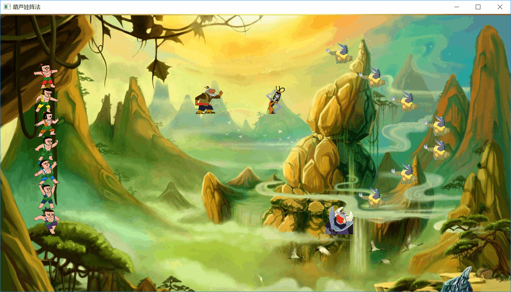
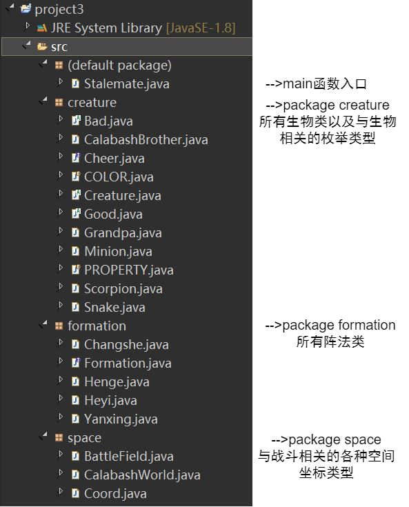

# 实验报告
---
### rewrite with GUI
采用JavaFx为葫芦娃排阵法加上了一个简单的GUI图形界面。   
代码总体在上次重构之后并没有什么大的变化，仅在输出战场的同时加上GUI的绘制即可。
```java
public void displayField() {
		System.out.print(battleField);
		// 以下两行是新增加的
		GraphicsContext gc = canvas.getGraphicsContext2D();
		battleField.guiDisplay(gc);
	}
```
背景图通过CSS样式表载入。对于在背景图上显示生物，最初的想法很自然：既然战场就是一个像植物大战僵尸那样的方格阵，我就使用GridPane构造那么多小格子，每个格子里放一个ImageView，然后排阵法的时候往ImageView上放Image不就行了吗？但实际上实施起来时，不仅因为遇到像grid不能先指定好格子的数目、不能设置大小等等不太方便但还算可以解决的问题，我还发现在格子数逐渐增加的时候，程序启动的越来越慢。后来突然想起来本学期同时再上的软件工程课中进行安卓项目开发时，有一次注意到对于一个xml文件，有一个“最大控件数”的属性（安卓项目默认好像是225）。查阅相关资料得知，一个界面文件中的控件数不能太多，否则会严重影响效率。我在一个页面上放置的ImageView太多，导致程序效率低下。所以最后放弃，采用了画布类Canvas，选择使用drawImage方法在指定位置绘制图片。同时给每个生物加上getImage方法用以获取它的图片。
```java
public void guiDisplay(GraphicsContext gc) {
		for (int i = 0; i < row; i++) {
			for (int j = 0; j < column; j++) {
				if (coords[i][j].existCreature()) {
					Image image = coords[i][j].getCreatrue().getImage();
					// 设置一个图片的大小为60*60,70和52分别为横向和纵向的偏移量
			        gc.drawImage(image, j*70, i*52, 60, 60);
				}
			}
		}
	}
```
我的设计是让图形界面每3秒刷新一次来更换两个阵营的位置和阵法。最初我使用Thread.sleep函数，但发现只有最后一次能成功显示，前几次窗口都是一片空白。我在JavaFx的文档中找到了关于这个问题的解释：
>The JavaFX scene graph, which represents the graphical user interface of a JavaFX application, is not thread-safe and can only be accessed and modified from the UI thread also known as the JavaFX Application thread. Implementing long-running tasks on the JavaFX Application thread inevitably makes an application UI unresponsive. A best practice is to do these tasks on one or more background threads and let the JavaFX Application thread process user events.   

所以我调用的sleep操作阻碍了UI线程，这意味着图像不能被刷新。关于这个问题在stackoverflow上找到了解决方案：放弃Thread.sleep，采用Timeline。
```java
world.displayField();// 先display一次
Timeline ThreeSecondsWonder = new Timeline(new KeyFrame(Duration.seconds(3), new EventHandler<ActionEvent>() {
    private int i = 1;
    @Override
	public void handle(ActionEvent event) {
        switch (i) {
		case 1:
			/* set and display */
			break;
		case 2:
			/* set and display */
			break;
		default:
			break;
		}
		i++;
	}
}));		
ThreeSecondsWonder.setCycleCount(2);
ThreeSecondsWonder.play();
```
最终实现效果如下所示：


---
### rewrite CalabashBrother
- 使用持有对象ArrayList替换数组
``` java
//private CalabashBrother[] brothers;
private ArrayList<CalabashBrother> brothers = new ArrayList<>();

//private Minion[] minions = new Minion[MINIONS_NUM];
private ArrayList<Minion> minions = new ArrayList<>(Collections.nCopies(MINIONS_NUM,new Minion()));
```
由于使用了持有对象，葫芦娃乱序和排序可以直接使用Collection的`shuffle`和`sort`方法，不再使用自己写的乱序和排序的函数。  
乱序：  
```java
Collections.shuffle(brothers);
```
排序：  
在CalabashBrother类需要继承接口Comparable并需要在类中重写compareTo函数使得葫芦娃可以被比较，如下所示：
```java
	@Override
	public int compareTo(CalabashBrother b) {
        if (this.rank > b.rank) {
            return 1;
        } else {
            return -1;
        }
	}
```
再直接调用sort函数即可：
``` java
Collections.sort(brothers);
```
- Gnerics泛型
坐标类Coord增加了限定符<T extends Creature>，明确了坐标上站着的是一种生物。
```java
public class Coord<T extends Creature>{...}
```
对于每一种阵法类，我增加了<T extends Creature>的限定符，表示该阵法在创建之时，就应该指定到底是谁在排阵法。是葫芦娃CalabashBrother？还是妖怪Bad？    
这样创建一个阵法时必须指定排阵法的对象类型了：
```java
world.setBrothers(new Changshe<CalabashBrother>(), 4, 1);
world.setMonsters(new Heyi<Bad>(), 3, 8);
```
施法函数conjure在数组换为持有对象ArrayList之后的参数也需要改了。
```java
//public boolean conjure(BattleField bf, Creature[] creatures, int startRow, int startColumn);
public boolean conjure(BattleField bf, ArrayList<? extends Creature> creatures, int startRow, int startColumn);
```
这里使用了通配符<? extends Creature>表示这是一个可以放Creature及其子类的ArrayList。

- RTTI
在不了解什么是“运行时类型信息之前”，我在Creature类中设置了一个枚举类型Property表示属性（Good or Bad），通过getProperty方法来获取类型信息。现在通过instanceof方法可以直接获取到类型信息了。
```java
if(!creatures.isEmpty() && creatures.get(0) instanceof Good) {
    ...
} else if(!creatures.isEmpty() && creatures.get(0) instanceof Bad) {
    ...
}
```

---
以下是原文件：
## 文件结构
本次实验采取 **一个类型一个java文件** 的设计方法，所以文件众多。为了方便项目管理与视图的清晰，将项目划分为几个包，将相关文件放入相关包中。具体结构如下图所示：



## 类图


## 设计思想
- 老师上课说过，在main函数中首先要做的是完成 **创世界** 的任务，所以我设计了CalabashWorld这个类，在葫芦世界里，有各种各样的生物、有战斗场所、有让世界运转的各种方法（即战斗过程）。CalabashWorld类的成员变量即为葫芦娃、爷爷、蛇精、蝎子精、小喽啰以及战斗场所；成员函数有葫芦娃的乱序、排序、葫芦娃按指定阵型投放、蝎子精和小喽啰按指定阵型投放、输出对峙局面等等。在CalabashWorld的构造函数中完成成员变量的初始化过程，在main函数中首先new一个CalabashWorld类，然后通过调用类的成员函数来推进战斗过程。
- 关于`抽象类、普通类、接口`的认识和在本次实验中的选择
1. 抽象类与普通类
    所谓抽象，就是一种只存在于概念而非具体的类型，也正是因为此抽象类不能被实例化。打比方说，人、男人、女人，其中人应该被设置为抽象类，男人和女人继承自人。因为只要一个实体是“人”，他必定是“男人”或“女人”中的一种，他不能不属于男人或女人而单独作为一个没有性别的“人”存在，所以抽象类“人”是不能被实例化的。根据这个认识，在本次实验中，Creature是所有生物类型的基类，它是一个抽象类，Good和Bad继承自Creature，也是抽象类，代表好人和坏人。CalabashBrother葫芦兄弟和Grandpa爷爷继承自Good（枚举类不能继承，所以葫芦娃类不再使用枚举类型），Snake蛇精,Scorption蝎子精和Minion小喽啰继承自Bad。
2. 抽象类和接口
    > 抽象类是对本质的抽象，接口是对动作的抽象。

    抽象类表示这个类是什么，而接口表示这个类能做什么。接口使得不同的类有相同的操作，又可以在不同类中去重写这个方法。由此，爷爷和蛇精都具有加油助威的能力，所以他们都应该继承一个Cheerable的接口，接口中有Cheer方法，并在各自类中重写这个Cheer方法（虽然现在还没有实际作用）。对于所有的阵法，我将其抽象为Formation接口，接口中声明了conjure函数，表示施法；其余所有的阵法类都继承自Formation接口，并在类中覆写conjure函数，排出不同阵型。

## 面向对象相关概念
1. 聚合  
    聚合是一种has-a的关系，但不是must have的关系，拥有类与被拥有类的生命周期可以不同。如CalabashWorld类由BattleField、CalabashBrother、Grandpa、Snake、Scorption、Minion组成，但CalabashWorld脱离了其中任意一个类仍然有意义。
2. 组合  
    组合也是一种has-a的关系，且是must have的关系，也称强聚合。整体与部分是不可分的，整体的生命周期结束也就意味着部分的生命周期结束。如BattleField类由Coord类组成，如果没有战斗场，战斗场上的坐标点就没有意义了。其实聚合和组合在代码中的表现形式相同，只是语义上的差别。
3. 继承  
    从已有类型中产生新类，新类包含已有类型的所有方法，并可以为自己添加新的方法。如Good和Bad继承自Creature，CalabashBrother和Grandpa继承自Good，Snake、Scorption、Minion继承自Bad。
4. 接口  
    接口是方法的抽象。接口中没有属性，只有方法声明，没有实现。如接口Cheerable代表具有加油助威的能力，而Grandpa和Snake具有这个能力，便继承自这个接口，并必须在各自类中实现接口中的方法。
5. 抽象类  
    抽象类是类本质的抽象。抽象类不能被实例化，但抽象类中可以有属性和方法，其中抽象方法必须在子类中实现。如Creature是一个抽象类，其中有一个抽象方法getProperty获取生物的属性（好或坏），在子类Good和Bad中完成了实现。
6. 多态  
    多态是同一个行为具有多个不同表现形式或形态的能力。就是同一个接口，使用不同的实例而执行不同操作。在BattleField类中override了toString操作，打印对峙局面时可以直接使用System.out.Println(BattleField)。

## 运行效果展示
