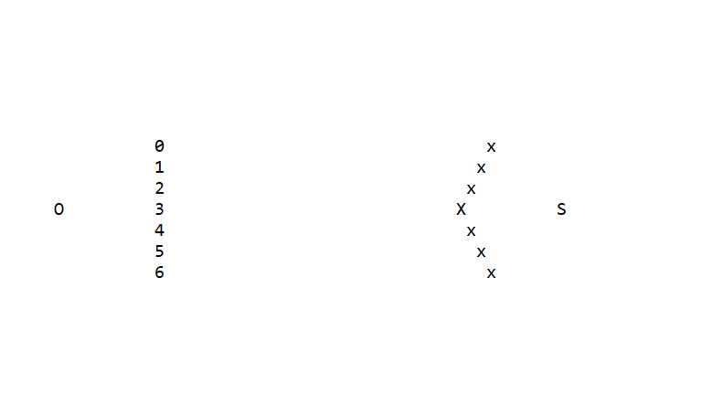
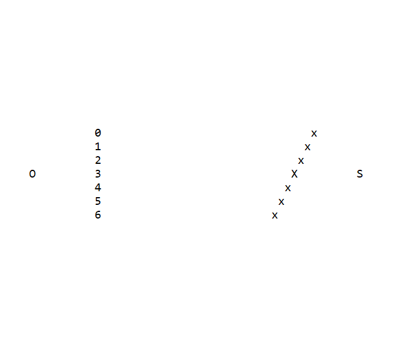

# 实验报告
## 代码结构
package homework3中共有六个类，分别是：
1. World类：在葫芦娃世界中起到“创世”和控制作用，能够控制各类Creature队形的编排和输出。World类里有本次作业的main函数。
2. Creature类：是葫芦娃世界中各类生物的基类，其中属性alive来判断该生物是否存活，printCreature函数用来输出Creature信息。
3. Oldman类：是Ceature的派生类，用来描述老爷爷。
4. Calabash类：是Ceature的派生类，用来描述葫芦娃。
5. Serpent类：是Ceature的派生类，用来描述蛇精。
6. Scorpion类：是Creature的派生类，用来描述蝎子精及其小喽啰，其中属性littlescrop表示该对象是蝎子精还是小喽啰。

## 面向对象的概念
* 继承：老爷爷、葫芦娃等对象本质都是生物，因此它们可以由Creature继承而来。它们都拥有alive这个属性，且对printCreature都进行了重写。
* 多态：在World类中对所有生物进行统一输出时，调用了printCreature，程序运行时根据动态绑定调用相应类重写过的printCreatue

## 实现效果
1. 输入0，蝎子精小喽啰阵营为鹤翼队形：

2. 输入1，蝎子精小喽啰阵营为燕行队形：

