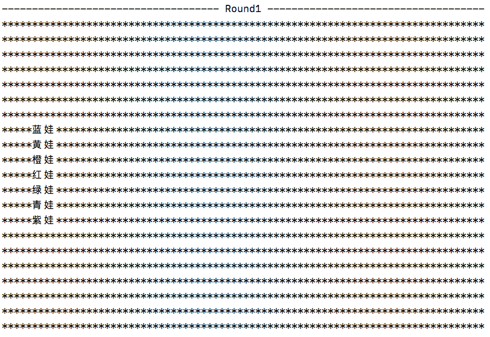
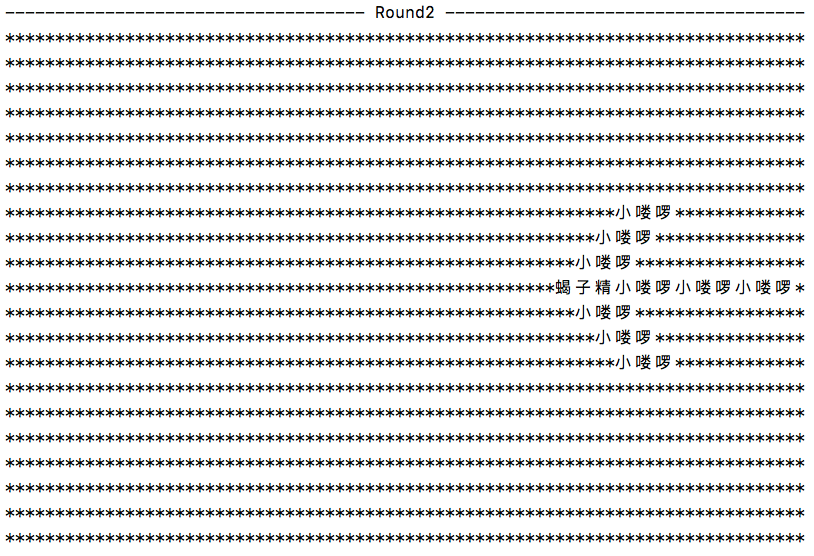
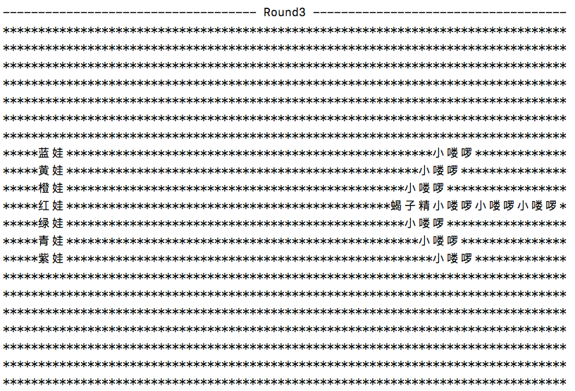
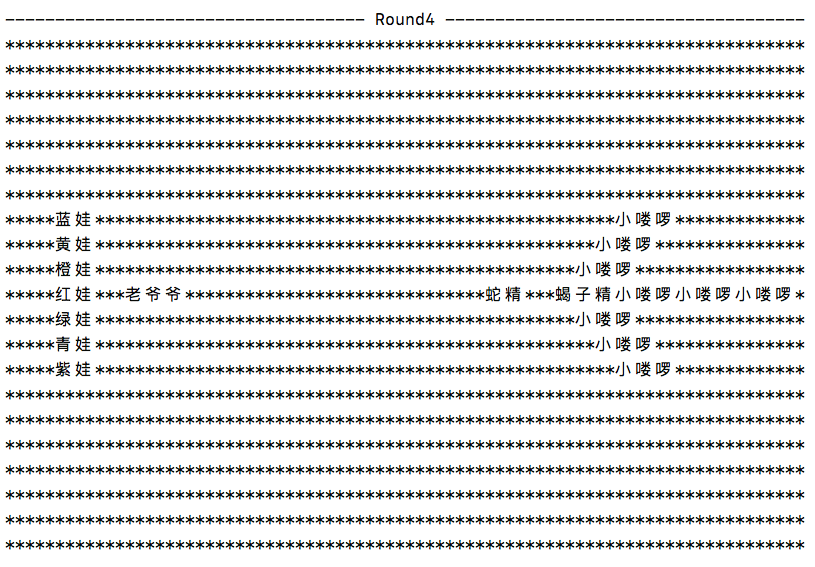
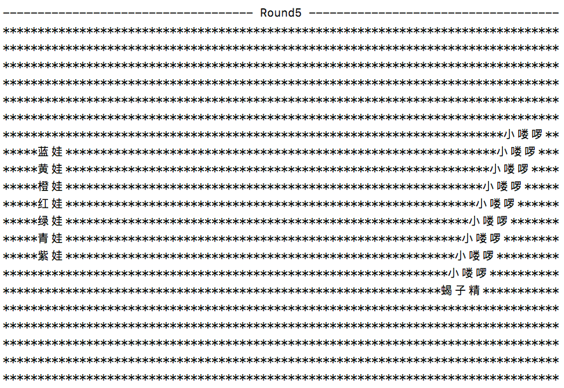
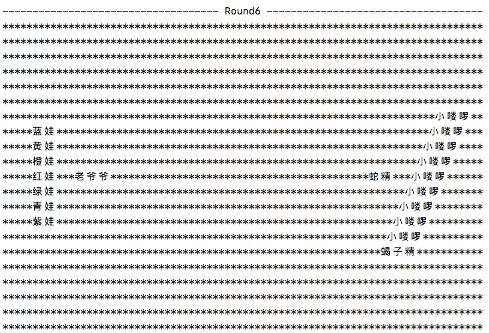

# 面向葫芦娃编程
## 思路
1. 首先，需要一个二维空间，用来放置各个生物体
2. 其次，有各种各样的生物体，生物体有一些共同的属性，比如在二维空间中的位置、自己的名字，也有一些共同的动作，比如移动（修改自己的位置）、说出自己名字、说出自己的坐标，所以可以从一个共同的基类继承这些共同的属性以及动作，在基类的基础上，各个生物体也许会有一些自己独特的属性，比如葫芦娃会有一个rank，也就是在七个兄弟中的排行，这可以用来得知年龄大小（光靠名称，不依赖其他条件是无法得知排行的）
3. 上面的空间和生物体，总的来说，都是属于芸芸众生，是“无序的”，需要一个最高的统治者来管理控制他们，这个管理者可以创造各个生物体、可以创造作战空间、可以安排各个生物体在空间上的排列、可以查看空间的排列状况
4. 最后，这些生物体需要作战，在作战过程中，统治者操纵这些生物体和二维空间

## 对应模块
1. 二维空间对应着class BattleField，是葫芦娃和小喽啰的作战场地
2. 所有的生物体继承自class Creature，class HuLuBrother是葫芦娃，class LittleMonster是小喽啰，class ScorpionMonster是蝎子精，class GrandPa是老爷爷，class SnakerMonster是蛇精;
3. class Manipulator是操纵者，拥有最高的权利（权利见上）
4. class Battle是作战过程（从此模块开始执行）

## 运行结果
说明：在实际中，每个生物体只占据空间上的一个位置坐标，而下面的结果中，生物体看起来不止占据了一个坐标，而是多个坐标（占据的坐标数量与名字长度相同），这样做只是为了展示的美观，可以把名字作战的位置看作一个坐标，并且其实二维空间是N x N的，但是下面的空间长与宽不等，这样也是为了便于展示，实际空间可以理解为在下面展示的空间的基础上的向外蔓延 
Round1: 葫芦娃站位 
Round2: 蝎子精小喽啰站位(锋矢) 
Round3: 葫芦娃、蝎子精小喽啰对峙 
Round4: 老爷爷、蛇精加入，加油助威，两方对峙 
Round5: 蝎子精小喽啰改变阵型(雁行)，与葫芦娃对峙 
Round6: 老爷爷、蛇精加入，加油助威，两方对峙 
 
 
 
 
 
 

