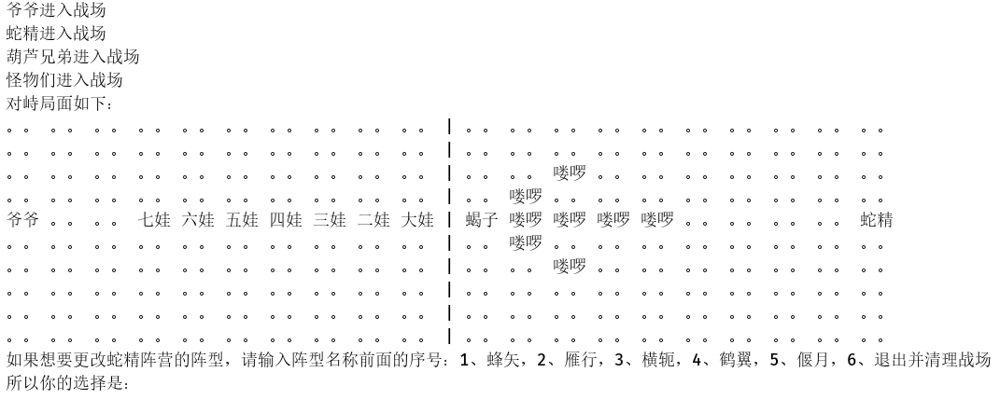
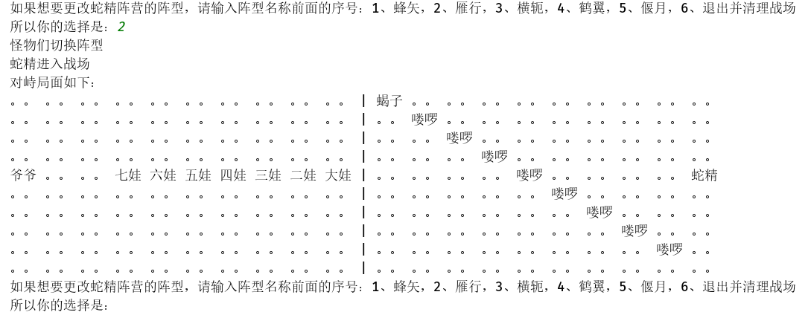
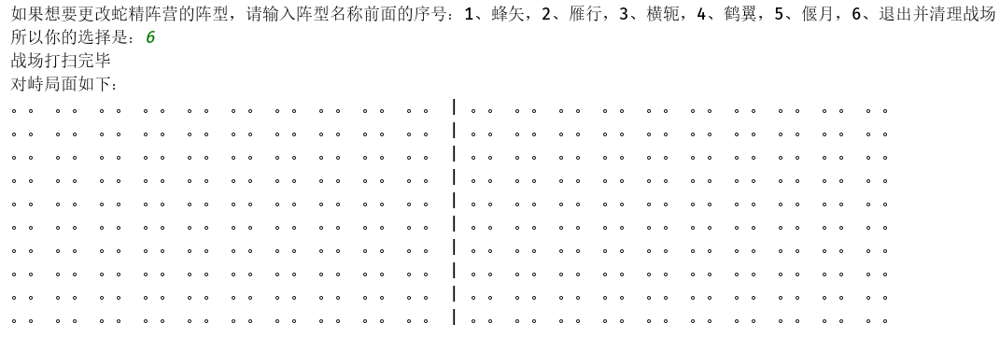

# 程序说明  

## 类的设计
主类```Battle```
+ 包括葫芦兄弟和妖精阵营进入战场```BattleBlock```，以及妖怪阵营的阵型变化部分  


```BattleBlock```类
+ ```leader```也就是蛇精和爷爷，```creatures```也就是葫芦兄弟和妖怪们进入战场的函数 ```leaderStand & creatureStand```
+ 由于妖怪阵营需要更换阵型，所以，需要对战场的某一半进行更新，即，```clearBattleBlock & change```
+ 由于很多函数在```BattleBlock```上的作用区间是半个战场，所以我设计了枚举类型```LeftRightEnum```用于本次函数调用的处理对象是哪半部分战场
+ 为了能输出战场上的对峙情况，设计了```printBattleBlock```用于打印战场上的对峙状态

```Creature```类
+ ```Creature```中包括```name & rank & position```三部分，其中```rank```用于区分排序各个生物的等级，```position```用于记录生物在战场中位置
+ 为了记录生物的位置，设计了```position```和用于便捷表示的二元组```Tuple```类，```Tuple```类也方便了```Formation```阵型类中的阵型记录
+ 葫芦娃、爷爷、妖怪全都是生物，所以设计了派生类```GourdDoll & Monster & Grandpa```，并用枚举类型```GourdDollEnum & MonsterEnum```枚举了葫芦兄弟和妖怪的信息

```Formation```类
+ 用于存放阵型，以及将阵型信息赋予生物们

## 介绍  
在开始，程序将给葫芦兄弟设计为长蛇阵，而将妖怪阵营设计为蜂矢阵  
之后可以进行选择1~5可以选择阵型，选择6则将退出战斗，并清理战场  

## 运行结果
+ __初始状态__
    
+ __选择新阵型__
    
+ __清理战场__
    
