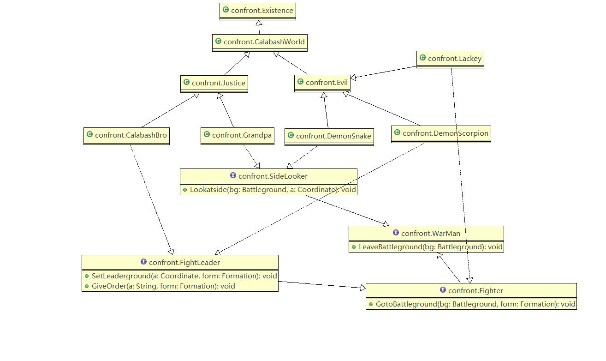

# Java面向葫芦娃编程作业3
## 设计思路
>创建一类列所需的元素（人物、地点、事件），理顺其交互关系，最后汇总到一起完成这次作业所需的操作。
## 元素详解
### Existence类
>生命的基类，具有名字、性质、位置等一个生物基本属性
### CalabashBro类 Grandpa类 DemonSnake类 DemonScorpion类 Lackey类
>都是继承了Existence类，分别是葫芦娃、老爷爷、蛇精、蝎子精、小喽啰。
```java
void SetLeaderground(Coordinate a, Formation form) //设置领导点，即阵型的关键点的位置  
void GiveOrder(String a, Formation form)  //发号施令，即决定摆出哪一种阵型  
void GotoBattleground(Battleground bg, Formation form) //奔赴战场，根据阵型找到自己站立的位置  
void LeaveBattleground(Battleground bg) //离开战场，直接撤退  
void Lookatside(Battleground bg, Coordinate a) //旁观，即直接选取战场中无人的位置站立  
```
### Battleground类
>定义了一个战场，采用二维数组的方式，每一个点是一个Spot类的对象。
```java
void show() //以print的方式打印出战场的布局 
``` 
### Spot类
>定义了战场上每一个具体点的信息，有坐标Cooridnate和该点上站立的生物Existence。  
```java
boolean SpotEmpty() //判断该位置是否为空  
void setExistence(Existence a) //记录某个生物站立到该位置上的信息  
void removeExistence() //记录某个生物离开该位置的信息  
```
### Formation类
>有领导坐标点leader和阵型数组layout来存放二维空间中阵型所需的位置信息。
```java
void setLeader(Coordinate a) //设置领导点  
void setLayout(String a) //根据不同的口令选取不同的阵型  
```
### Coordinate类
>这个是为了描述的方便创立的坐标类，数据成员就是两个int型的数代表x和y。      
```java
void add(Coordinate a, Coordinate b) //两个坐标的加法，是为了将阵型的相对偏移转变成绝对偏移  
```
### Lineup类
>一个葫芦娃的队列，主要实现了随机站队算法和排序算法。   
```java
void Randomsort() //随机的站队
void Bubblesort() //冒泡排序
void Insertsort() //插入排序
```
### Story类
>相当于一个上帝视角，创造出之前定义的类的对象，有序地组织和演示题目所要求的各项事件。   
```java
void CalabashBroShowup(Coordinate c, String a) //葫芦娃上阵  
void GrandpaShowup(Coordinate c) //老爷爷旁观  
void LackeyShowup(Coordinate c, String a) //蝎子精带领小喽啰上阵  
void DemonSnakeShowup(Coordinate c) //蛇精旁观  
void AllLeaveaway() //所有人离场  
void main(String[] args) //入口函数，启动整个程序  
```
  
---  
## 第一次改进
**1、对Existence.java进行了重构，加入了CalabashWorld,Justice,Evil等类，力求更加地贴近实际。**     
### CalabashWorld类   
>这是一个抽象类，将Existence放到更高层的抽象，只保存一个名字，而Calabash类中定义了坐标、性质等针对“特定的存在”--葫芦娃世界而定义的属性。   
### Justice类和Evil类   
>这同样是两个抽象类，继承自CalabashWorld类,目的是将葫芦娃的世界分成两个阵营，一个是正义阵营，一个是邪恶阵营，这样葫芦娃、爷爷、蛇精、蝎子精、小喽啰具体的类则根据自身正义和邪恶的属性决定继承Justice还是Evil类。   

**2、吸收了Interface的思想,利用接口更好地封装了函数，更好地实现了多态。**     
### WarMan接口   
>代表战场上的人，都有离开战场的方法。   
```java
void LeaveBattleground(Battleground bg);
```
### Fighter和SideLooker接口   
>代表战士和旁观者，继承自WarMan接口，战士有奔赴战场方法，旁观者有旁观的方法。   
```java
void GotoBattleground(Battleground bg, Formation form);  
void Lookatside(Battleground bg, Coordinate a);  
```
### FightLeader接口
>代表战争指挥者，继承自Fighter接口,指挥者有设置领导点以及决定摆什么阵型的方法。   
```java
void SetLeaderground(Coordinate a, Formation form);
void GiveOrder(String a, Formation form);
```
>下面附上Existence.java的类图：
   

---   
## 第二次改进
**1、想在程序中使用Collection，但是发现代码中多处使用一维和二维数组，修改起来相当繁琐，以及就目前功能而言，使用Collection没有明显优势，因此没有选择改进。**    
**2、想在程序中使用Generics，但是发现在我的设计中，葫芦娃、爷爷、蛇精、蝎子精、喽啰虽然都继承自顶层的CalabashWorld这个类，但是在将他们组合到一起放入一个战场的时候，他们有很明显的不一样的功能和操作，所以使用Generics来统一他们是不恰当的，不能反映实际，所以暂时没有选择使用泛型。**   
   
