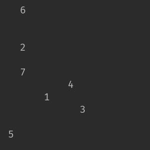
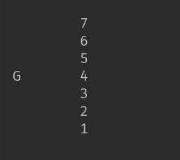
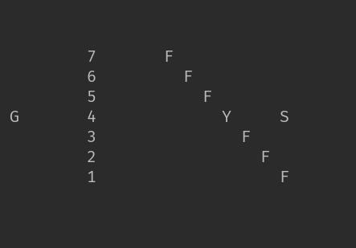
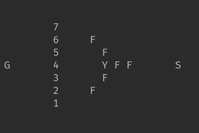
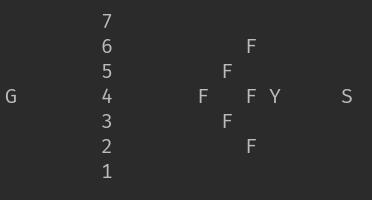

# 葫芦娃——排兵布阵  
## 161220123 王荆涛  
---
### 一、代码框架  

<table border=0 cellpadding=0 cellspacing=0 width=709 style='border-collapse:
 collapse;table-layout:fixed;width:531pt'>
 <col width=166 style='mso-width-source:userset;mso-width-alt:5888;width:124pt'>
 <col width=163 style='mso-width-source:userset;mso-width-alt:5802;width:122pt'>
 <col width=380 style='mso-width-source:userset;mso-width-alt:13511;width:285pt'>
 <tr height=18 style='height:13.8pt'>
  <td height=18 class=xl65 width=166 style='height:13.8pt;width:124pt'>Package</td>
  <td class=xl65 width=163 style='width:122pt'>Class</td>
  <td class=xl65 width=380 style='width:285pt'>Information</td>
 </tr>
 <tr height=18 style='height:13.8pt'>
  <td rowspan=2 height=36 class=xl65 style='height:27.6pt'>CommonMethods</td>
  <td class=xl65>Dispatcher</td>
  <td class=xl65>调度器，用于初始化随机位置</td>
 </tr>
 <tr height=18 style='height:13.8pt'>
  <td height=18 class=xl65 style='height:13.8pt'>PointNode</td>
  <td class=xl65>存储生物的坐标，并与战场坐标分离，便于调度和排兵布阵</td>
 </tr>
 <tr height=18 style='height:13.8pt'>
  <td rowspan=7 height=126 class=xl65 style='height:96.6pt'>Creature</td>
  <td class=xl65>(abstract)Creature</td>
  <td class=xl65>包含了三个抽象类，将生物分为正义阵营和邪恶阵营</td>
 </tr>
 <tr height=18 style='height:13.8pt'>
  <td height=18 class=xl65 style='height:13.8pt'>CreatureCreater</td>
  <td class=xl65>初始化所有生物的类</td>
 </tr>
 <tr height=18 style='height:13.8pt'>
  <td height=18 class=xl65 style='height:13.8pt'>CalabashBoy</td>
  <td class=xl65>葫芦娃类，实际上是一个枚举类型，属于正义阵营</td>
 </tr>
 <tr height=18 style='height:13.8pt'>
  <td height=18 class=xl65 style='height:13.8pt'>Grandfather</td>
  <td class=xl65>爷爷类，作为正义阵营的首领发号施令</td>
 </tr>
 <tr height=18 style='height:13.8pt'>
  <td height=18 class=xl65 style='height:13.8pt'>Snake</td>
  <td class=xl65>蛇精类，作为邪恶阵营的首领发号施令</td>
 </tr>
 <tr height=18 style='height:13.8pt'>
  <td height=18 class=xl65 style='height:13.8pt'>Scorpion</td>
  <td class=xl65>蝎子精类，作为邪恶阵营的将军带领喽啰战斗</td>
 </tr>
 <tr height=18 style='height:13.8pt'>
  <td height=18 class=xl65 style='height:13.8pt'>Flunky</td>
  <td class=xl65>喽啰类，作为邪恶阵营的小兵</td>
 </tr>
 <tr height=18 style='height:13.8pt'>
  <td height=18 class=xl65 style='height:13.8pt'>Formation</td>
  <td class=xl65>Formation</td>
  <td class=xl65>阵营类，存储各阵型的坐标</td>
 </tr>
 <tr height=18 style='height:13.8pt'>
  <td height=18 class=xl65 style='height:13.8pt'>Ground</td>
  <td class=xl65>Point</td>
  <td class=xl65>战场坐标类，可以在后续为战场加入不同情境</td>
 </tr>
 <tr height=18 style='height:13.8pt'>
  <td height=18 class=xl65 style='height:13.8pt'></td>
  <td class=xl65>GroundCreature</td>
  <td class=xl65>战场构造类，用于产生和刷新战场</td>
 </tr>
 <tr height=18 style='height:13.8pt'>
  <td height=18 class=xl65 style='height:13.8pt'>MainDemo</td>
  <td class=xl65>MainDemo</td>
  <td class=xl65>驱动类</td>
 </tr>
 <![if supportMisalignedColumns]>
 <tr height=0 style='display:none'>
  <td width=166 style='width:124pt'></td>
  <td width=163 style='width:122pt'></td>
  <td width=380 style='width:285pt'></td>
 </tr>
 <![endif]>
</table>
之所以将战场坐标的Point类和通用坐标的PointNode类分开，是因为两者具有不同的作用。  

Point：组成战场的基本类型，为了后续构造出战场的不同情况，如该坐标点中有树丛，可以提供额外的防御值，或该坐标点已经被完全破坏，无法站立生物等；  
PointNode：用于存储当前存活在战场上的生物坐标，便于调度器调度排兵布阵。  

### 二、继承关系
>public abstract class Creature
>>abstract class GoodGuy extends Creature
>>>public class CalabashBoy extends GoodGuy
>>>public class Grandfather extends GoodGuy
>>
>>abstract class Monster extends Creature
>>>public class Snake extends Monster
>>>public class Scorpion extends Monster
>>>public class Flunky extends Monster
>
>public class Point
>>public class GroundCreater extends Point

### 三、代码详解
#### Dispatcher
```java
public void initPosition{
   ……
}
```
这段代码继承自第二次作业，用于随机生成葫芦娃的初始位置
#### PointNode
```java
public class PointNode {
   ……
}
```
用于存储已生成的生物的坐标和姓名，便于排兵布阵
#### Creature
包含了三个抽象类
```java
public abstract class Creature
abstract class Monster extends Creature
abstract class GoodGuy extends Creature
```
用于定义阵营的好坏，将生物体加以区分;  
Creature是所有生物的父类，因此具有坐标、姓名等私有变量
#### CalabashBoy
```java
public class CalabashBoy extends GoodGuy{
    public enum boy{
        RED("赤",1,"1"),ORANGE("橙",2,"2"),YELLOW("黄",3,"3"),GREEN("绿",4,"4"),
        CYAN("青",5,"5"),BLUE("蓝",6,"6"),PURPLE("紫",7,"7");
        ……
    }
}
```
继承自第二次作业，利用枚举定义了数量固定且属性已知的七个葫芦娃
#### Grandfather
```java
public class Grandfather extends GoodGuy{
    private Formation newFormation;

    public Grandfather()
    public void addToBattle(){
    public void changeFormation(String name, PointNode[] pos)
}
```
爷爷类，具有对葫芦娃发号施令的功能，因此持有私有变量newFormation以及方法changeFormation，用于改变葫芦娃的阵型
#### Snake
```java
public class Snake extends Monster{
    private Formation newFormation;

    public Snake()
    public void addToBattle()
    public void changeFormation(String name, PointNode[] pos)
}
```
蛇精类，类似于爷爷类，可以对蝎子精和小喽啰们发号施令
#### Scorpion & Flunky
```java
public class Scorpion extends Monster{
    public Scorpion()
}

public class Flunky extends Monster{
    public Flunky()
}
```
蝎子精类和小喽啰类，构造函数为他们设定姓名以便于打印在屏幕上，后续将加入各自的技能
#### Formation
```java
public class Formation {
    public Formation(){}
    public void Formation(String name, String camp,PointNode[] array, int xBase, int yBase){
        switch(name){
            case "鹤翼": crane(array, camp, xBase, yBase); break;
            case "雁行": wildgoose(array, camp, xBase, yBase); break;
            case "衡轭": cross(array, camp, xBase, yBase); break;
            case "长蛇": snake(array, camp, xBase, yBase); break;
            case "鱼鳞": fish(array, camp, xBase, yBase); break;
            case "方门": door(array, camp, xBase, yBase); break;
            case "偃月": moon(array, camp, xBase, yBase); break;
            case "锋矢": arrow(array, camp, xBase, yBase); break;
        }
    }
    public void crane(PointNode[] array, String name, int xBase, int yBase)
    public void wildgoose(PointNode[] array, String name, int xBase, int yBase)
    public void cross(PointNode[] array, String name, int xBase, int yBase)
    public void snake(PointNode[] array, String name, int xBase, int yBase)
    public void fish(PointNode[] array, String name, int xBase, int yBase)
    public void door(PointNode[] array, String name, int xBase, int yBase)
    public void moon(PointNode[] array, String name, int xBase, int yBase)
    public void arrow(PointNode[] array, String name, int xBase, int yBase)
}
```
利用switch语句，根据不同的指令选择要变换的阵型  
目前只能在各个阵型中固定每个生物体的坐标，后续根据战场情况变化(可能会有障碍物等)，通过xBase和yBase作为基准坐标来确定每个生物的坐标
#### Point
```java
public class Point{
    private boolean isCreature;
    private String name;

    Point()
    public boolean isCreature()
    public void setCreature(boolean creature)
    public String getName() 
    public void setName(String name)
}
```
isCreature用于判断该战场坐标是否存在生物
name便于该战场坐标打印在屏幕中，它不仅仅指葫芦娃或者怪兽的名字，也可以是后续可能加入的草丛、石头、陷阱等
#### GroundCreater
```java
public class GroundCreater extends Point{
    private static int maxSize = 15;
    private static Point[][] ground = new Point[maxSize][maxSize];
    public PointNode[] calabashpos= new PointNode[7];
    public PointNode[] monsterpos = new PointNode[7];
    private CalabashBoy.boy[] calabashBoys;
    public CreatureCreater goodGuys;
    public CreatureCreater monsters;

    /**用于生成初始化的战场
    *  根据题目要求，同时初始化葫芦娃
    *  生成随机的葫芦娃序列
    */
    public GroundCreater()

    //用于初始化蛇精、蝎子精和小喽啰
    public void initMonsters()

    /**根据PointNode中存储的葫芦娃和怪物们的坐标
    *  对应到相应的Point战场坐标上
    */
    public void initGround()

    //用于每次改变阵型后刷新战场格局
    public void refreshGround()

    //打印战场
    public void showGround()
}
```
### 四、实现效果

初始战场，葫芦娃乱序  


爷爷加入后，葫芦娃变换成长蛇阵  


蛇精、蝎子精、喽啰加入战场，初始化为雁行阵  


蛇精发令，变换成偃月阵  


蛇精再次发令，变换成鱼鳞阵  

### 五、心得体会
1、低耦合、高内聚的代码有利于以后的重构和维护，但是我目前做的并不好  
2、老师讲的SOLID原则在设计中非常有用，会通过重构代码去实践
