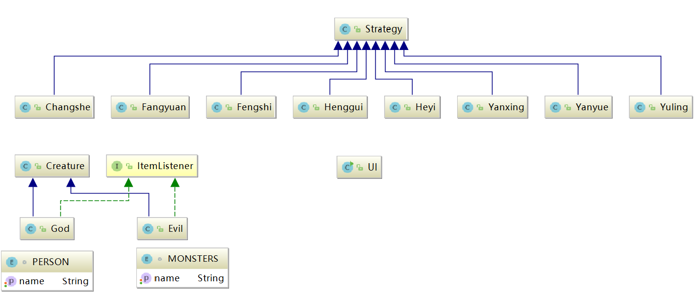
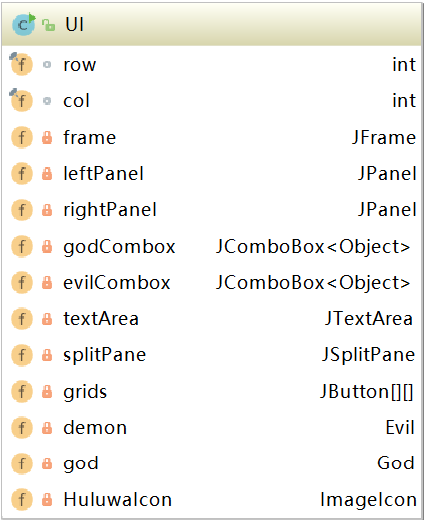
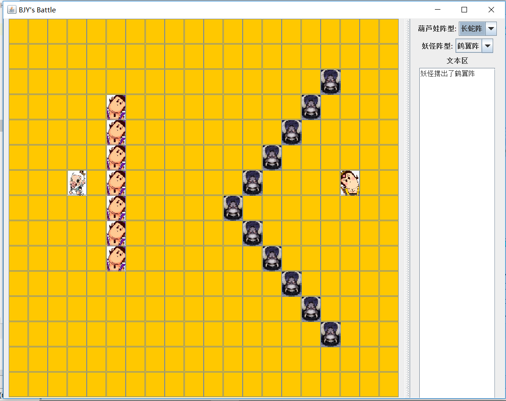

# Update2 
## 10.31更新 
1. 添加了图形界面 
2. 修改了README，重新审视了代码结构，初步利用容器类型 

## 思路（UML图） 
UML图如下： 
  
有三个由广义的Object类的子类：界面（UI）、阵法（Strategy）、生物体（Creature）。  
界面负责显示用户页面，并且反馈使用者的需求（即请求摆出什么阵型），然后将需求信息传递给生物体处理。 
生物体收到信息后决定采取对应的阵法。向阵法类发送信息，获得阵法的相关坐标，经过处理后将需要显示的信息发送给UI。 
阵法类就是负责反馈阵法信息。 
这样处理的好处是将功能分发给不同的对象，每个对象相互独立，有不同的职责，
## 深入各个类
### UI 
  
UI主要负责界面显示，所以主要处理Frame上控件的初始化，
以及能够提供一个能修改一定地址摆放的人物的函数。  

UI中棋盘中每个棋盘由一个按键对象相对应，一个对象显示一个格子。  

UI接受使用者传来的调度信息，并传达给Creature类。
也提供了响应Creature类，一系列与显示有关的函数。 
 
### Creature 
1、父类默认构造函数为“草”，这样能够提供最基本的访问。   

2、子类God和Evil均可以向UI传递信息，向战场中安排生物体。选择子类实现是因为两者不同点较多，可以方便以后对两者区分修改。比如为两者加上不同的技能。   

3、选择用继承方式实现的原因：一方面是两者之间有逻辑上的继承关系，便于理解，另一方面是两者之间共同点较多，
用接口不便于处理，而且继承方便下一步的扩展。  

4、子类可以与Strategy类、UI类发送信息交流。  

5.为了区分，God表示的好人不会出现妖怪的头像，结合之前的经验，使用enum类可以保证这类错误不会发生。   

| God | enum类型 |  evil | enum类型 |
| ------ | ------ | ------ | ------ |
| 葫芦娃 | HERO | 小喽啰 | UGLY |
| 爷爷 | GRANDPA | 蛇精 | BOSS|
### Strategy  
 
1、按照阵法要求，返回地图中某点是否需要派兵  

2、返回阵法中统领的X、Y坐标  

3、strategy作为抽象类，下面的子类是各个不同阵法。
利用继承关系可以复写父类中的函数，所以能实现不同的阵法效果。
实际上我觉得在这里使用接口也可以。   

## 实现结果 
 

## 实现细节亮点
1、虽然在God、Evil都有类似的private量，但是通过实现不同的enum枚举变量，避免出现两者混合的错误  
2、利用不同的方法比如Map、数组来储存阵法信息  
3、继承的广泛使用为后续的修改留有余地，便于接下来给葫芦娃和妖怪不同的技能  

  
