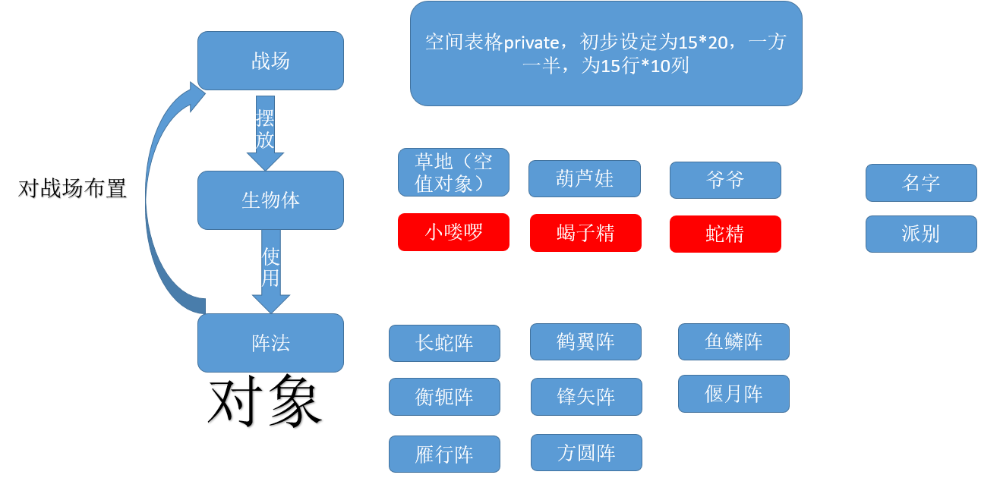

# 思路
分成三个对象，分别在不同的文件夹：战场（Battlefield）、阵法（Strategy）、生物体（Creature）。  
  
生物体作为父类，God、Evil作为子类。  
但是God和Evil 有不同的枚举类型，保证了不能妖怪召唤出葫芦娃的情况。  
阵法由creature来在Battlefield上执行，阵法也可以用接口来实现，但是如果把阵法当作一个父类，不同阵法作为子类，这样生物体在调用阵法的时候参数可以用父类的阵法表示。  
## 各个类的功能
### Battlefield
1、初始化战场为一个储存生物体的二维数组，战场上长满草  
2、展示战场上的信息  
3、清扫战场  
4、安排生物到地图上  
### Creature
1、初始化为草  
2、子类God和Evil均可以向Battlefield传递信息，向战场中安排生物体  
3、打印自己的信息  
### Strategy
1、按照阵法要求，返回地图中某点是否需要派兵  
2、返回阵法中统领的X、Y坐标  
## 实现细节亮点
1、虽然在God、Evil都有类似的private量，但是通过实现不同的enum枚举变量，避免出现两者混合的错误  
2、利用不同的方法比如Map、数组来储存阵法信息  
3、继承的广泛使用为后续的修改留有余地，便于接下来给葫芦娃和妖怪不同的技能  

  

                                                                                                                                                                                                                                                                                                                                                                                                                                                                                                                                                                                                                                                                                                                                                                                                                                                                                                                                                                                                                                                                                                                                                                                                                                                                                                                                                                                                                                                                                                                                                                                                                                                                                                                                                                                                                                                                                                                                                                                             