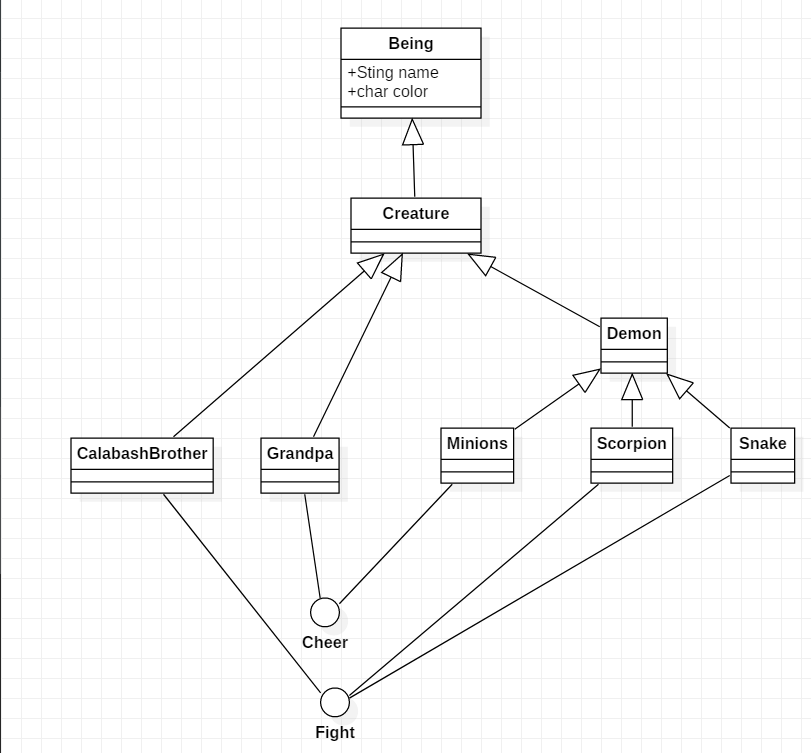

# 面向葫芦娃编程
## homework3
### 各个包及其中类的职责
#### creature包
- Being类为最基本的类，含有所有事物（包括生物和非生物，非生物暂时未涉及到）的基本属性，name和symbol；
- Creature类为所有生物的父类；
- CalabashBrother类为葫芦娃的类，含有葫芦娃对应的颜色和序号，创建葫芦娃对象时只需要传入相应葫芦娃的序号即可；
- CBEnum类为枚举类，包含了所有葫芦娃的基本信息；
- Grandpa类为老爷爷；
- Demon类为所有妖精的父类（包括蛇精、小喽啰、蝎子精）；
- Minions、Scorpion、Snake类分别为小喽啰、蝎子精和蛇精；
- Cheer和Fight两个接口规定了部分角色应该有的功能。

#### formation包
- Formation为所有八个阵列的父类，包含构造方法和一个布阵的方法，构造方法需要传入阵列的行和列的大小，布阵的方法需要传入队列；
- 八个子类阵列有各自不同的布阵方法，其中鹤翼、雁行、冲轭、长蛇阵可以自行选择排阵的人数，鱼鳞、方円、偃月、锋矢阵的人数已经确定了。

#### field包
- BattleField类为葫芦娃与妖精战斗的战场，有打印战场的功能；
- Cell类为战场上的每一个格点，葫芦娃或者妖精可以占据一个格点，一个格点只能被一名角色占据；
- Position为对坐标的表示，控制角色的移动。

#### 其他
- Coordinator类担任指挥员的角色，负责葫芦娃的排序以及一个队伍排成相应的阵列；
- 主类负责对各个角色、队伍、指挥员的初始化。

### 设计思路
- 对角色、阵列进行封装，便于后续的使用和维护，而指挥员角色的存在将角色和阵列有效地结合了起来；
- 总步骤大致为，在主类里初始化阵列和两个队伍（葫芦娃和妖精），再有指挥员来指挥队伍排成相应的队列，再一起空降至最初的阵列中，最后在安排老爷爷和蛇精的位置，再将阵列打印出来；

### 较上一次的改进
- 使用javafx添加了GUI

