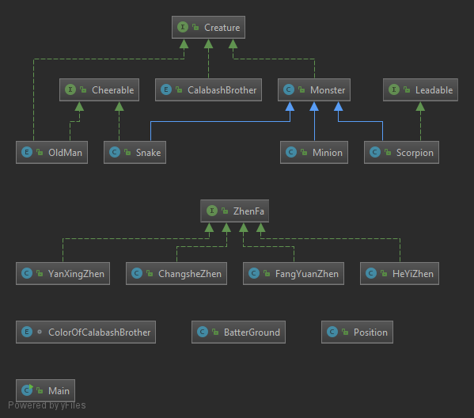
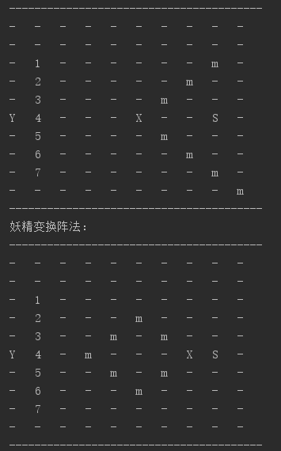

## UML图

## 代码中的面向对象思想

### package creature

- 根据上一节课所讲，将`CalabshBrother`,`OldMan`定义为`Enum`类，理由是葫芦兄弟是固定的7个，老爷爷只有一个（妖精的数量是确定的吗？），常量对象更能体现实际。
- 所有生物都实现了`Creature`接口，此接口包含的功能包括返回自身的`Symbol`，移动`moveTo`，离开`leavefrom`。实际上，我更倾向于将`Creature`定义为抽象类（因为其中的一些方法是通用的，且定义一些属性的需求）。但是java不支持多继承，而`CalabshBrother`,`OldMan`均定义为了`Enum`类，即继承自`java.lang.Enum`类。这是一个困惑。
- 为了缓解上述的问题，为所有的妖精设计了相同的基类`Monster`，实现了接口`Creature`，并定义了一些共有的方法和属性。
- 加油助威`cheer`,领导`Lead`更像是一种能力，所以将其抽象为接口

### package space

- `Position`是一个方块，方块上可站立`Creature`。
- `BatterGround`是战场，由`Position`矩阵组成，是对峙局面的形成处。

### package zhenfa

- 阵法是一种改变阵形的能力，将其抽象为接口，方法包括施阵`apply`,收阵`clear`。

## 结果展示

葫芦娃:1-7， 爷爷:Y，小喽啰:m， 蝎子精:X ，蛇精:S

