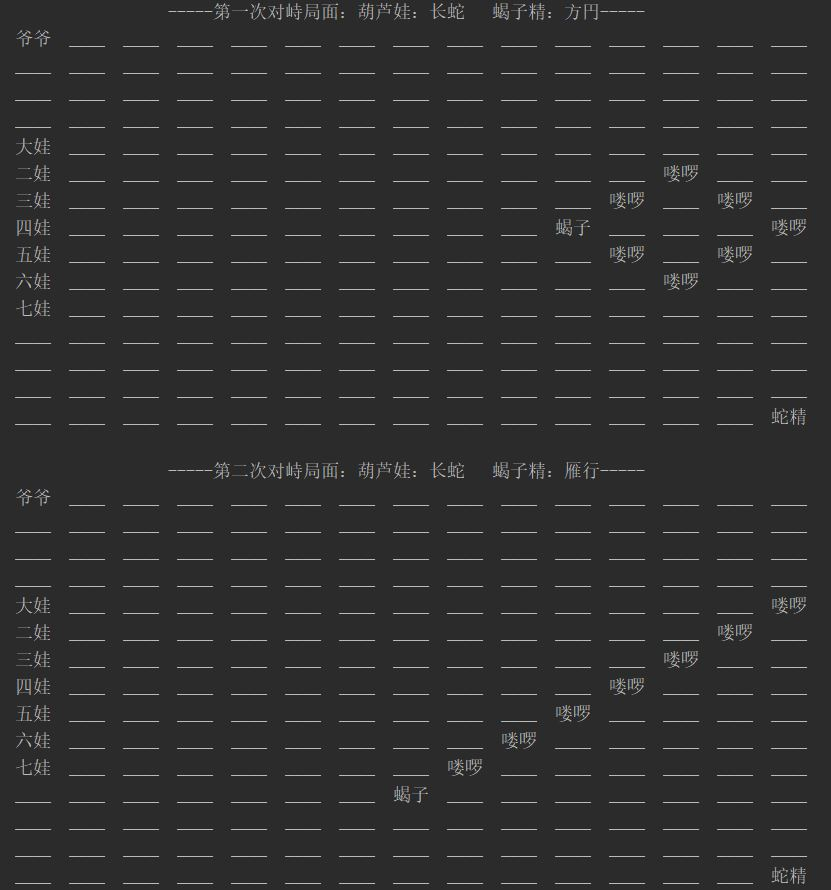

# 第三次作业

---
## 设计思想
1. 由于需要一个二维空间，该空间中的任意一个位置坐标上可站立一个生物体，所以将位置坐标抽象成Cell类，将二维空间抽象成BattleField类，并包含一个NxN的二维数组，每个cell都有自己的坐标，知道此位置上是否有单位（unit），有哪个单位。。
2. 需要有葫芦娃、老爷爷、蛇精、蝎子精、小喽啰五种生物体，每种生物体都有一些相同的属性和不同的属性，于是可以先创建一个基类Unit，其成员为共有属性。Grandpa、Scorpion、Snake、Monster、CalaBashBrother这五个类继承基类Unit，并包含自己的独特的属性。所有的单位都有自己的名字，并且知道自己所处的位置坐标。
3. 各生物体要占据一个位置坐标，要有一定的阵形，并能不断变换。所以需要一个“控制者”来操纵这些变化，于是抽象出Player类，包含生物体坐标变化的相关操作。

---

## 代码简介
1.BattleField.java

 - Cell类
```java
class Cell
{
    private boolean isEmpty;
    private Unit unit;
    public void setUnit(Unit unit);        //设置unit
    public void setEmpty(boolean x);       //设置isEmpty
    public Unit getUnit();                 //返回unit
    public boolean getStatus();            //返回isEmpty
}
```
 - BattleField类
```java
public class BattleField {
    private Cell[][] cells = new Cell[15][15];
    public void print();                   //打印对峙局面
    public Cell[][] getCells();            //返回二维数组
}
```
2.Unit.java

 - Unit类
```java
public class Unit {
    private int x;
    private int y;
    private String name;
    public void set(int x,int y);          //设置该单位的坐标
    public int getX();                     //返回x坐标
    public int getY();                     //返回y坐标
    public String getName();
}
```
- Grandpa、Scorpion、Snake、Monster、CalaBashBrother类
```java
class Grandpa extends Unit{
    private String name;
    Grandpa(){ name = "爷爷"; }
    @Override public String getName(){ return name; }
}

class Scorpion extends Unit{
    private String name;
    Scorpion(){ name = "蝎子"; }
    @Override public String getName(){ return name; }
}

class Snake extends Unit{
    private String name;
    Snake(){ name = "蛇精"; }
    @Override public String getName(){ return name; }
}

class Monster extends Unit{
    private String name;
    Monster(){ name = "喽啰"; }
    @Override public String getName() { return name; }
}

class CalaBashBrother extends Unit{
    private int number;
    private String name;
    private String color;
    public int getNumber() { return number; }
    @Override public String getName() { return name; }
    public String getColor() { return color; }
}
```
3.Player.java

 - Player类
```java
public class Player {
    //冒泡排序，用于给初始乱序的葫芦娃排序
    public void bubble_sort(CalaBashBrother[] gourds, int n);
    //将unit放置到field的（x，y）上
    public void create(Unit unit, BattleField field, int x, int y);
    //将unit移动到field的（x，y）上
    public void change(Unit unit, BattleField field, int x, int y);
    //创建葫芦娃阵型：长蛇
    public void CB_formation_init(BattleField field,Unit[] gourds, int start);
    //创建蝎子精阵型：方円
    public void MO_formation_init(BattleField field,Unit[] monsters, int start_x, int start_y);
    //变换蝎子精阵型：雁行
    public void MO_formation_change_1(BattleField field,Unit[] monsters, int start_x, int start_y);
}
```

---
## 用到的机制及好处
 - 封装：此程序封装了9个类，好处在于能隐藏内部实现，提高代码的安全性，也使得代码便于理解
 - 继承：Grandpa、Scorpion、Snake、Monster、CalaBashBrother继承了父类Unit，提高了代码的复用性和可维护性，使类与类之间产生关系，便于理解，也能大大减少代码的冗余程度
 - 多态：Unit的子类重写了父类的方法，在编译器进行动态绑定后，可根据对象类型来调用不同子类的方法，提高可扩充性和可维护性

---
## 运行结果
<!-- .element width="80%" height="65%" -->