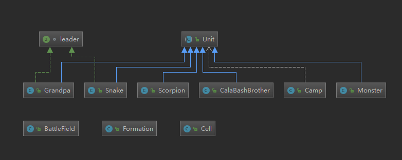

# 第三次作业

## 更新v4
1. 使用javafx进行GUI绘制
2. 更新文件结构，删除Player类，其功能由Main类代替。将数据部分放在data包中，将GUI界面部分放在sample包中，实现数据与界面的分离。
<!-- .element width="80%" height="65%" -->
 - 运行结果
<!-- .element width="80%" height="65%" -->

## 更新v3
1.在camp类中使用泛型，成功解决了第二次更新后遗留的问题，通过getLeader方法返回的leader对象即为创建时传进的对象，可以使用他自己的方法。
```java
public class Camp<T extends Unit> {
    private ArrayList<Unit>soldiers;
    private T leader;
    ...
    public T getLeader()
    {
        return leader;
    }
}
```
2.在相关方法中的Camp参数中使用类型通配符。
```java
public static void ChangShe(BattleField field,Camp<? extends Unit> camp, int start);
```

## 更新v2
1. 将每个类单独放在一个文件中，而不是将多个类先写在一个文件里，使代码结构更清晰
2. 由于不需要Unit实例，而是用其他生物类继承此类，因此将Unit改为抽象类，并将getName改为抽象方法，以供子类重写
3. 新增leader接口，提供cheer方法
4. 新增Camp类、Formation类
5. 删除Player类中除main方法以外的方法，并将其移动到BattleField类和Formation类中

## 设计思想
1. BattleField类构建了战场，其成员包含了Cell类，即战场上的每个格子，格子记录了在其上的Unit。BattleField类还提供了setUnit方法，能将一个Unit对象放置在战场上。
2. Unit类是一个 **抽象类**，因为它作为基类，而且并不需要Unit实例。Grandpa、Scorpion、Snake、Monster、CalaBashBrother这五个类继承基类Unit，并包含自己的独特的属性。所有的单位都有自己的名字，并且知道自己所处的位置坐标。设计继承关系的好处在于不仅能使得对象之间的关系更加清晰，还能为其他类中的方法提供统一的调用参数，避免了相同方法不同参数类型的重载。
```java
abstract public class Unit {
    private int x;
    private int y;
    ...
    public abstract String getName();
}

class Grandpa extends Unit implements leader
{
    private String name;
    Grandpa()
    {
        name = "爷爷";
    }
    public String getName(){ return name; }
    public void cheer(){
        System.out.println("爷爷：加油！");
    };
}
```
3. Grandpa、Snake作为leader，可以为其他对象加油，因此有一个leader接口，用于规范leader对象的行为，即可以cheer。
```java
interface leader
{
    void cheer();
}
```
4. 由于涉及到阵营的阵型变换，因此创建了Camp类和Formation类，Camp类存储了该阵营的成员（用Unit类型的Arraylist）和（T类型的）leader。Formation类则针对Camp类提供了不同阵型变换的方法。leader上使用泛型，可在日后访问的时候调用该对象特有的方法。

## 用到的机制及好处
 - 封装：此程序封装了多个类，好处在于能隐藏内部实现，提高代码的安全性，也使得代码便于理解
 - 继承：Grandpa、Scorpion、Snake、Monster、CalaBashBrother继承了父类Unit，提高了代码的复用性和可维护性，使类与类之间产生关系，便于理解，也能大大减少代码的冗余程度
 - 多态：Unit的子类重写了父类的方法，在编译器进行动态绑定后，可根据对象类型来调用不同子类的方法，提高可扩充性和可维护性

## 后续思考
1. 由于Camp类中的成员是以Unit类型存储的，因此，这个类只能用于为阵型变换提供方便（一种阵型只需要写一个方法），涉及到调用5个子类自己的方法时，不能直接用Camp类。此问题可用泛型解决：当创建camp对象时，初始化leader为Grandpa类型，虽然在运行时刻，leader的实际类型为Unit，但通过getLeader可返回Grandpa类型的对象。这样就可调用Grandpa中的cheer方法。
2. 5类生物大致分为两种，一种是能cheer的leader（2类），另一种是能战斗的soldier（3类），后续应该提供两种接口以统一方法，但在调用时不能将这些子类放在Unit类型的容器中。
3. 由于当前还不知道各生物是否有各自独特的方法，因此camp中的soldiers单位暂时采用ArrayList<Unit>，若直接采用泛型，可以解决葫芦娃的问题。但蝎子精和喽啰均放在此列表中，在后续代码中可考虑将其分离。