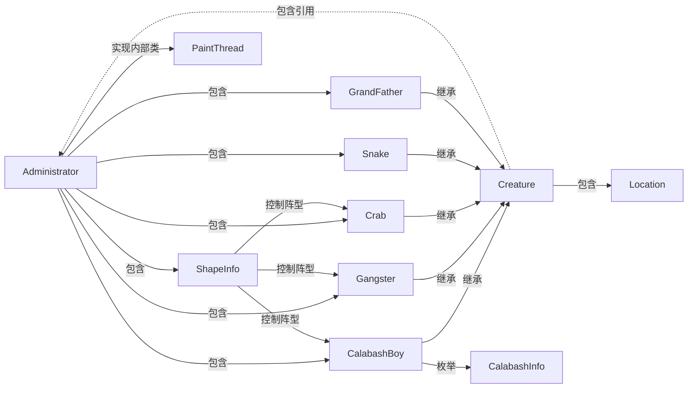

# Java 第三次作业2.0

**邓开圣 161220031**

[TOC]

## 1. 代码使用方法

将src文件夹中的源代码文件与resources文件夹中的资源文件**放在同一目录下**，然后直接运行代码即可，按空格键变换阵型。

本文件若有无法阅读的部分请参见[README.pdf](https://github.com/KSDeng/java-2018f-homework/blob/master/20180925/%E9%82%93%E5%BC%80%E5%9C%A3-161220031/2.0/README.pdf)

## 2. 整体结构




## 3.代码特色分析

### 枚举类型

```java
//CalabashInfo.java
//葫芦娃的枚举
public enum CalabashInfo {
	Red("老大"),
	Orange("老二"),
	Yellow("老三"),
	Green("老四"),
	Cyan("老五"),
	Blue("老六"),
	Purple("老七");
	private String name;	
	private CalabashInfo(String name) {
		this.name=name;
	}
}
```

```java
//ShapeInfo.java
//阵型的枚举
public enum ShapeInfo {
	heyi("鹤翼"),
	yanxing("雁行"),
	henggui("衡轨"),
	changshe("长蛇"),
	yuling("鱼鳞"),
	fangmen("方门"),
	yanyue("偃月"),
	fengshi("锋矢");
	public String name;
	private ShapeInfo(String n) {
		this.name = n;
	}
}
```


### 泛型

```java
//Administrator.java
//存放葫芦娃
public List <CalabashBoy> calabashes = new ArrayList <CalabashBoy>();
//蝎子精和喽啰
public List <Creature> monsters = new ArrayList <Creature>();
```


### 容器

主要用到的容器是ArrayList和HashMap

```java
//Administrator.java
//葫芦娃信息和形象的映射表
public static Map <CalabashInfo, Image> boysImg = new HashMap <CalabashInfo, Image>();
private static Image[] CalabashBoysImgs = null;
static {
	CalabashBoysImgs = new Image[] {
		new ImageIcon("resources/characters/calabash/red.PNG").getImage(),
		new ImageIcon("resources/characters/calabash/orange.PNG").getImage(),
		new ImageIcon("resources/characters/calabash/yellow.PNG").getImage(),
		new ImageIcon("resources/characters/calabash/green.PNG").getImage(),
		new ImageIcon("resources/characters/calabash/cyan.PNG").getImage(),
		new ImageIcon("resources/characters/calabash/blue.PNG").getImage(),
		new ImageIcon("resources/characters/calabash/purple.PNG").getImage()
	};
    //在葫芦娃的枚举与其形象之间建立一一映射，大大提高了程序可读性和易维护性
	boysImg.put(CalabashInfo.Red, CalabashBoysImgs[0]);
	boysImg.put(CalabashInfo.Orange, CalabashBoysImgs[1]);
	boysImg.put(CalabashInfo.Yellow, CalabashBoysImgs[2]);
	boysImg.put(CalabashInfo.Green, CalabashBoysImgs[3]);
	boysImg.put(CalabashInfo.Cyan, CalabashBoysImgs[4]);
	boysImg.put(CalabashInfo.Blue, CalabashBoysImgs[5]);
	boysImg.put(CalabashInfo.Purple, CalabashBoysImgs[6]);
}
```


### 继承

CalabashBoy（葫芦娃）、Gangster（小喽啰）、Crab（蝎子精）、Snake（蛇精）、GrandFather（老爷爷）都继承于Creature（生物体）类，并在Creature中实现其公共属性

```java
//Creature.java
//生物体类
public class Creature {
	protected Location loc;
	public Administrator admin;
	protected int sizex = 60, sizey = 60;	
    ...
    //检测生物体的碰撞
	public boolean hitAnother(Creature c) {
		return this.getRect().intersects(c.getRect());
	}
	public boolean hitOthers(List<Creature> others) {
		for(int i=0;i<others.size();i++) {
			if(this.hitAnother(others.get(i)))
				return true;
		}
		return false;
	}
}
//CalabashBoy.java
public class CalabashBoy extends Creature{
	...
}
//Gangster.java
public class Gangster extends Creature{
    ...
}
//Crab.java
public class Crab extends Creature{
    ...
}
//Snake.java
public class Snake extends Creature{
    ...
}
//GrandFather.java
public class GrandFather extends Creature{
    ...
}
```


### 双缓冲机制

用双缓冲机制绘图以减少闪烁

```java
//Administrator.java
Image OffScreenImage = null;	//绘图缓冲
@Override
public void update(Graphics g) {
	if(OffScreenImage == null) {
		OffScreenImage = this.createImage(mainwindow_sizex,mainwindow_sizey);
	}
	Graphics gOffScreen = OffScreenImage.getGraphics();
	paint(gOffScreen);
	g.drawImage(OffScreenImage, 0, 0, null);
}
```


### 多线程

用内部类PaintThread实现窗口的重画

```java
//Administrator.java
private class PaintThread implements Runnable{	
	@Override
	public void run() {
		while(true) {
			repaint();	
			try {
				Thread.sleep(50);
			} catch (InterruptedException e) {
				e.printStackTrace();
			}					
		}
	}	}
```


### 键盘事件处理

空格键变换阵型

```java
//Administrator.java
private class KeyMonitor extends KeyAdapter{
	@Override
	public void keyPressed(KeyEvent e) {
		switch(e.getKeyCode()) {
		case KeyEvent.VK_SPACE: 	//按下空格键
			change_shape();			//改变阵型
			break;
		default:break;
		}
	}
	@Override
	public void keyReleased(KeyEvent e) {
        
	}		
}
```


## 4.部分效果展示


<center>锋矢</center>


<center>方门</center>


<center>鱼鳞</center>


<center>偃月</center>

