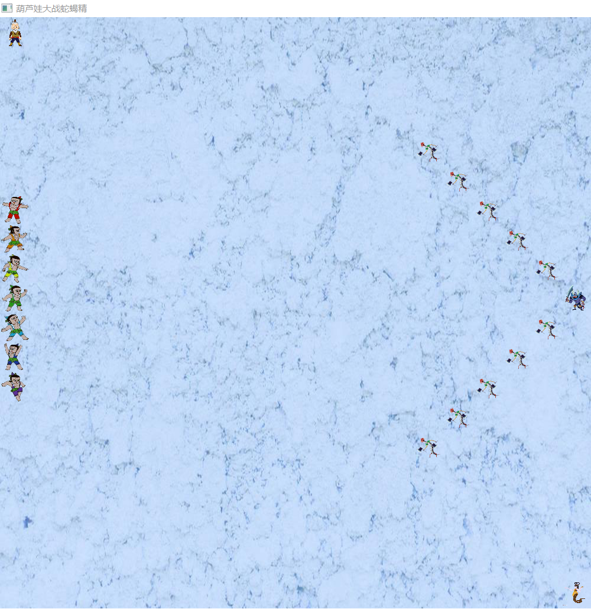
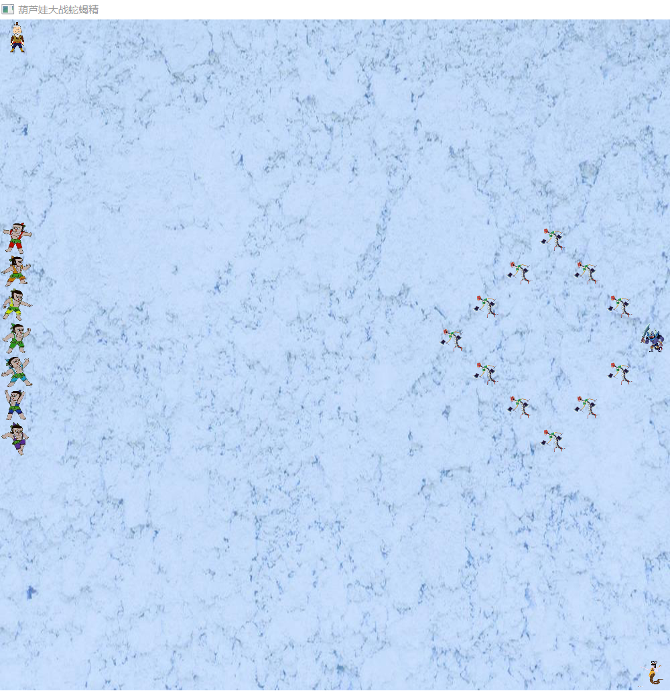
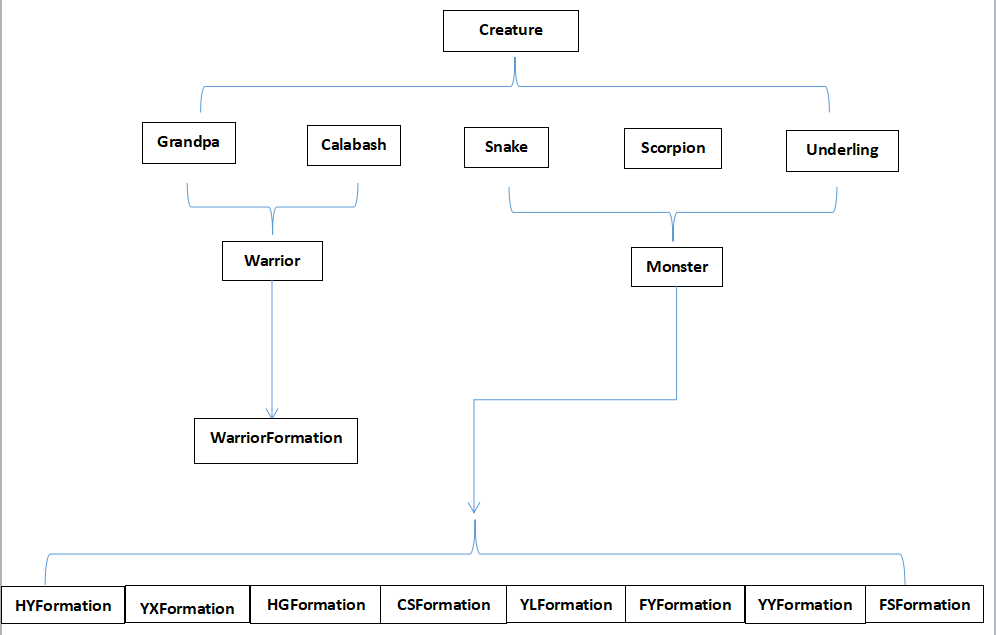

# **面向葫芦娃编程**
## **更新GUI(JavaFX)**
	在Creature类中为每个生物添加一个共用属性url（提供对应图片的地址），然后在Creature的子类初始化时将url初始化，每个生物体对应一个图片；
	在Battlefield类中添加image变量，用于存储战场上每个位置所存的图片（类型为ImageView）；
	添加了名为sample的package，实现了战场的图形化（可以输入战场的大小，选择阵型）；
## **实现结果**
	
	
	

## **Creature类**
	Creature类是一个父类，它包含了所有生物体所共用的属性（生物名name），这些属性设置为protected，方便子类操作；
## **Grandpa类**
	Granpa类是一个子类，继承于Creature类，可进行初始化；
## **Calabash类**
	Calabash类是一个子类，继承于Creature类，但是新增了一个属性rank，便于区分7个不同的葫芦娃；
## **Warrior类**
	Warrior类（勇士类）封装了一个加油的老爷爷和七个战斗的葫芦娃，可以对葫芦娃进行乱序初始化，排序；
## **WairrorFormation类**
	WairrorFormation类定义了勇士类中的老爷爷和葫芦娃们在战场上的位置。
## **Snake类**
	Snake类是一个子类，继承于Creature类，可进行初始化；
## **Scorpion类**
	Scorpion类是一个子类，继承于Creature类，可进行初始化；
## **Underling类**
	Underling类是一个子类，继承于Creature类，可进行初始化；
## **Monster类**
	Monster类封装了一个加油的蛇精、一个战斗的蝎子和一群战斗的喽��，可以定义喽��的数量；
## **MonsterFormation类**
	MonsterFormation类是一个接口，定义了formation函数，方便后面的继承的重写该函数实现不同的阵型排布（如HYFormation、YXFormation、HGFormation等）；
## **BattleField类**
	BattleField类对外隐藏了表示战场大小的变量N和表示战场状态的变量isbeing、creature，对外只提供设置生物体在战场上的位置和打印战场的功能；
## **Main类**
	Main类实现类用户的输入和结果的输出。
## **好处**
	该代码中运用了封装、继承，多态等，保护了内部状态，增强了安全性和可维护性，易于代码的复用。