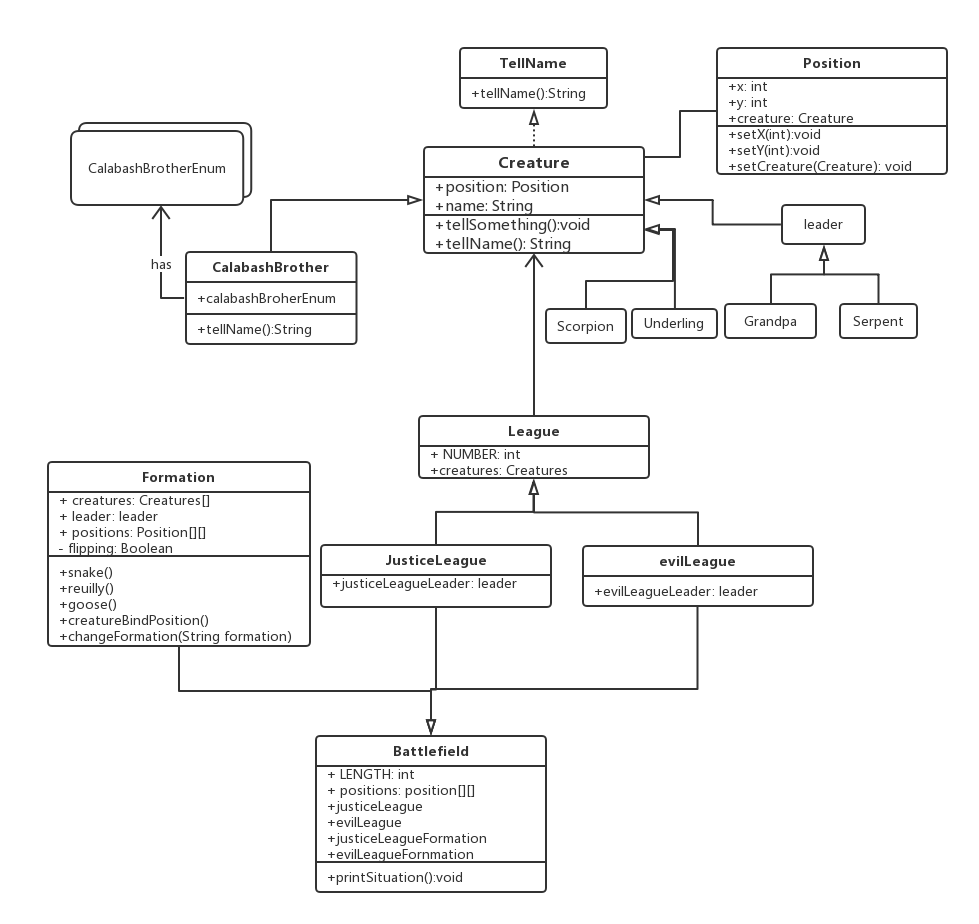

# 设计思路
所有活物都是*Creature*，每个*Creature*有一个*Position*和*name*

*Position*是一个位置类，他有x值和y值，以及*Creature*，即在这个位置的*Creature*。

*Creature*与*Position*相互引用

*League*是*Creature*的集和，包含了一个*Leader*和*creatures*

JusticeLeague是正义联盟（葫芦娃联盟），有一个领导为*Grandpa*

evilLeague是邪恶联盟，领导是Serpent(蛇精)

正义联盟和邪恶联盟相遇就会进行战斗，加上一个*Position[]*,就能形成一个Battlefield(战场)，

在战斗状态下，每个阵营能有自己的*Formation*(阵法)

