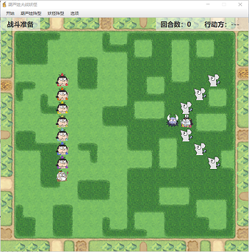
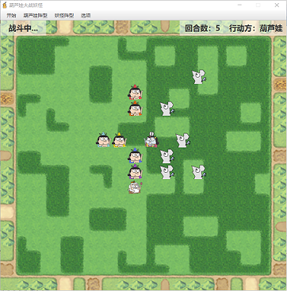
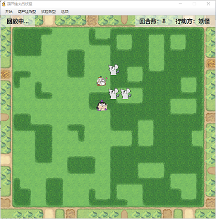
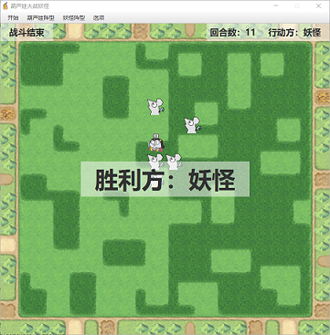

# World v4.2 版

- 当前版本

- 新实现的要求和功能有：
  - 按 **L** 键或点击菜单栏“**开始 -> 读取**”显示文件对话框让用户选择一个 xml 文件，读取战斗过程
  - 按 **S** 键或点击菜单栏“**开始 -> 保存为**”将战斗过程另存为指定名称的 xml 文件
  - 按 **R** 键直接重置到初始状态
  - 按 **P** 键在战斗结束之后直接回放本次战斗
  - **战斗过程的回放**，依然是按**空格**键显示下一回合
  - 对于不合法的键盘操作或菜单栏操作弹出 **Alert 提示框**
  - **GUI 界面**更加精致友好
- 下一阶段目标：
  - 为代码中的重要方法编写单元测试用例，并使用 Maven 进行构建管理
  - 细节，禁止实体对象“出界(EntityState.OUT)”（当前允许出界，出界等同于死亡）
  - 游戏平衡的设定优化（例如决定生死的概率、行进方向、攻击范围等）


## 修改说明

- 由于增加了“回放”功能，整个应用运行的模式/状态分为 2 × 3 = 6 种
  - 模式
    - [战斗]：每个回合的行为都是现计算并显示的
    - [回放]：每个回合的行为都是从文件读取的，已经确定的
  - 状态
    - [准备]：初始化结束，战斗还未开始（第 0 回合）
    - [进行中]：战斗正在进行
    - [结束]：战斗结束，场上只剩下一方阵营


### （一）package world.util

#### class Global

新增的重要全局变量/方法有：

```java
	/**	保存战斗记录	*/
	public static XMLRecordWriter recordWriter = null;
	/**	读取战斗记录	*/
	public static XMLRecordReader recordReader = null;
	/**	战斗是否开始	*/
	public static boolean battleStart = false;
	/**	战斗是否结束	*/
	public static boolean battleEnd = false;
	/**	战斗胜利方	*/
	public static GroupType battleWin;
	/**	是否正在回放战斗过程	*/
	public static boolean battlePlayingBack = false;
    /**	弹出提示框
     *	@param head 提示框标题内容
     *	@param content 详细说明	*/
	public static void showAlertDialog(String head, String content) {
		Alert alert = new Alert(AlertType.INFORMATION);
		alert.setTitle("提示");
		alert.initOwner(Main.worldStage);
		alert.setHeaderText(head);
		alert.setContentText(content);
		alert.showAndWait();
	}
```
当前状态与battleStart/battleEnd的关系为：

[准备]		battleStart = false, battleEnd = false

[进行中]		battleStart = true, battleEnd = false

[结束]		battleStart = true, battleEnd = true


### （二）package world

#### 1. class Main

增加应用图标 icon.png：

```java
	@Override
	public void start(Stage primaryStage) {
        ...
		primaryStage.getIcons().add(new Image("file:img/icon.png"));
        ...
    }
```


#### 2. class Entity

原先的属性 public Entity target，更名为 public Entity **enemy**：

原先的 target 在“大乱斗”模式下有三种取值：

- 若目标移动位置是空地，则 target = null
- 若目标移动位置上有本阵营对象，则 target = this（不移动）
- 若目标移动位置上是敌方对象 en，则 target = en（指向该敌方对象）

现在的 enemy 仅允许两种取值：

- 若目标移动位置上是敌方对象 en，则 enemy = en（指向该敌方对象）
- 否则 enemy = null

这样有利于 xml 文件的读写，因为 xml 文件的 round\* 节点的 Attribute “enemy” 的值就只有 “null” 和 “\*\*\*\*” (Entity.id) 了，而利用 id 很容易找到 Map 中对应的 Entity 指针

除此之外，Entity 类新增了一个方法 **stand()** ，因为葫芦娃和妖怪是轮流行动的，而回合是半个半个计算的，在葫芦娃行动的时候妖怪没有行动，这就需要将妖怪实体对象的“运动属性”清空：

```java
	public void stand() {
		direction.reset(0, 0); 
		enemy = null;
		hasWined = false;
	}
```

这样在读取文件时才不会出现葫芦娃和妖怪同时移动的情况


### （三）package world.xml

#### 1. class XMLRecordStructure

- 定义了与 xml 文件的读写相关的静态常量和静态函数

战斗记录的xml文件形如：

```xml
<records>
	<entity1056 ctype="Bro4" r="7" c="5">
		<round1 state="LIVE" posr="7" posc="6" dr="0" dc="1" enemy="null" win="false"/>
		<round2 state="LIVE" posr="7" posc="6" dr="0" dc="0" enemy="null" win="false"/>
		<round3 state="LIVE" posr="7" posc="7" dr="0" dc="1" enemy="1091" win="false"/>
        ...
	</entity1056>
	<entity1091 ctype="Bro6" r="9" c="4">
        ...
	</entity1091>
    ...
</records>
```

静态常量可以防止手残打错字符串：

```java
	// 各节点名String
	protected static final String records = "records"; // 根
	protected static final String entity = "entity"; // 第一层子节点
	protected static final String ctype = "ctype"; // Entity -> creature -> type
	protected static final String r = "r"; // Entity 初始位置行
	protected static final String c = "c"; // Entity 初始位置列
	protected static final String round = "round"; // 第二层子节点
	protected static final String state = "state"; // Entity -> state
	protected static final String posr = "posr"; // Entity -> position -> row
	protected static final String posc = "posc"; // Entity -> position -> col
	protected static final String dr = "dr"; // Entity -> direction -> row
	protected static final String dc = "dc"; // Entity -> direction -> col
	protected static final String enemy = "enemy"; // Entity -> enemy
	protected static final String win = "win"; // Entity -> hasWined
```

静态函数则实现了从各种类型到String以及从String到各种类型的转化，以EntityState为例：

```java
	/**	@return 对应的状态 */
	protected static EntityState toEntityState(String label) {
		switch (label) {
		case "LIVE": return EntityState.LIVE;
		case "DEAD": return EntityState.DEAD;
		default: return EntityState.OUT;
		}
	}
```


#### 2. class XMLRecordWriter extends  XMLRecordStructure

- 实现战斗记录**保存为 xml 文件**

在构造函数中获取文件指针和根元素：

```java
	private Document doc = null;
	private Element root = null;
	public XMLRecordWriter() {
		doc = DocumentHelper.createDocument();
		root = doc.addElement(records);
	}
```

保存战斗记录的机制有两个：

（1）自动保存：每进行半个回合（即每单击键盘空格）保存一次，本局[结束]后自动保存文件到 Global 类定义的默认地址：

```java
	public static final String defaultFilename = "records/defaultRecordFile.xml";
```

这样就能够实现战斗结束后，不使用文件选择器选择文件，直接回放本局战斗的功能。

（2）手动保存：在[战斗]模式下，本局[结束]状态，按 **S** 键或点击菜单栏“**开始 -> 保存为**”打开文件选择器，将战斗过程另存为指定名称的 xml 文件，即：

```java
	public void saveRecord(String filename) {
		try{
            XMLWriter writer = new XMLWriter(OutputFormat.createPrettyPrint());
            FileOutputStream fos = new FileOutputStream(filename);
            writer.setOutputStream(fos);
            writer.write(doc); // 导出
            System.out.println("对战过程保存至“" + filename + "”");
            writer.close();
        } catch(Exception e){
            e.printStackTrace();
        }
	}
```

保存的时机是，每次[战斗]模式下：

[准备]状态，需要根据 Map<Integer, Entity> **entities** 集合的值，添加每一个实体对象对应的 entity\*\*\*\* 节点（\* 代表该实体对象的 id 号），调用：

```java
	public void addEntityElements() {
		for (Entity en: CoreWorld.entities.values()) { // 遍历entities并存储
			Element entityEle = root.addElement(entity + en.id);
			entityEle.addAttribute(ctype, en.creature.getType().label);
			entityEle.addAttribute(r, String.valueOf(en.position.row()));
			entityEle.addAttribute(c, String.valueOf(en.position.col()));
		}
	}
```

[进行中]状态，**每单击空格键调用 start()** 之后，都要保存一次节点，即在每个 entity\*\*\*\* 节点下添加一个 round\* 节点（\* 代表回合数），调用：

```java
	public void addRoundElements(int n) {
		for (Entity en: CoreWorld.entities.values()) { // 遍历entities并存储
			Element roundEle = root.element(entity + en.id).addElement(round + n);
			roundEle.addAttribute(state, en.state.label);
			roundEle.addAttribute(posr, String.valueOf(en.position.row()));
			roundEle.addAttribute(posc, String.valueOf(en.position.col()));
			roundEle.addAttribute(dr, String.valueOf(en.direction.row()));
			roundEle.addAttribute(dc, String.valueOf(en.direction.col()));
			roundEle.addAttribute(enemy, toEntityLabel(en.enemy));
			roundEle.addAttribute(win, toBooleanLabel(en.hasWined));
		}
	}
```

这样就实现了从【每半个回合更新一次的 Map<Integer, Entity> **entities** 集合】到【拥有所有实体对象的每个回合情况的一群节点】的转换


#### 3. class XMLRecordReader extends  XMLRecordStructure

- 实现战斗记录 **xml 文件的读取**

在构造函数中直接读取 xml 文件，获得根元素

```java
	public XMLRecordReader(String filename) {
		super();
		try {
			SAXReader reader = new SAXReader();
			doc = reader.read(new File(filename));
            System.out.println("读取对战过程自“" + filename + "”");
			root = doc.getRootElement(); // 获取根元素
			initEntitiesByElement(); // 初始化 entities 集合
		} catch (DocumentException e) {
			e.printStackTrace();
		}
	}
```

其中方法 **initEntitiesByElement()** 将所有 entity\*\*\*\* 节点的信息转化并写入空的 **entities** 集合；

与 XMLRecordWriter 类相反，XMLRecordReader 类实现了从【拥有所有实体对象的每个回合情况的一群节点】到【每半个回合更新一次的 Map<Integer, Entity> **entities** 集合】的转换，即**每单击空格键调用 start()** 之后，都要根据当前回合数的 round\* 节点信息来更新 **entities** 集合：

```java
	public void setEntityByRound(Entity en, int n) {
		// 使用此函数需确保entities集合不为空
		Element roundEle = root.element(entity + en.id).element(round + n);
		if (roundEle != null) {
			EntityState st = toEntityState(roundEle.attributeValue(state));
			int pr = Integer.parseInt(roundEle.attributeValue(posr));
			int pc = Integer.parseInt(roundEle.attributeValue(posc));
			int movr = Integer.parseInt(roundEle.attributeValue(dr));
			int movc = Integer.parseInt(roundEle.attributeValue(dc));
			Entity ene = toEnemy(roundEle.attributeValue(enemy));
			boolean w = toBoolean(roundEle.attributeValue(win));
			en.resetEntity(st, pr, pc, movr, movc, ene, w);
			// 判断战斗是否结束
			if (root.element(entity + en.id).element(round + (n + 1)) == null)
				Global.battleEnd = true;
		}
	}
```


### （四）package world.gui

#### 1. class GUIWindow

##### （1）GUI 界面优化

增添了一些组件，以更好地显示当前状态（见窗口左上角和右上角）：






这些组件是：

```java
	@FXML
	private Label modeLabel; // 模式：[战斗]或[回放]；状态：[准备]或[进行中]或[结束]
	@FXML
	private Label groupLabel; // 行动方：[葫芦娃]或[妖怪]
	@FXML
	private Label roundLabel; // 显示回合数
	@FXML
	private Label observer; // 用于打印战斗结果
```

在合适的时机改变它们显示的文本即可


##### （2）回放功能 —— 对“单击键盘空格”以及 start() 方法的扩展

```java
	/**	每单击键盘空格调用	*/
	private void pressKeySpace() {
		Global.battleStart = true;
		if (!Global.battleEnd) { // 战斗未结束
			Global.roundNum += 1; // 回合数加1（从“第1回合”开始）
            ...
	        start(); 
            ...
			// 临时存储
			if (!Global.battlePlayingBack) // 回放模式不存储
				Global.recordWriter.addRoundElements(Global.roundNum); 
			Global.battleEnd = Global.isEnded(); // 判断是否结束 
			// 如果战斗/回放[结束]
			if (Global.battleEnd) {
				if (Global.battlePlayingBack) { // 回放模式不存储
                    ...
				}
				else { // 导出到默认文件
                    ...
					Global.recordWriter.saveRecord(Global.defaultFilename);
				}
			}
		}
	}
```

```java
	public void start() {
		for (Entity en: CoreWorld.entities.values()) {
			// 通过回放或线程改变en的运动属性
			if (Global.battlePlayingBack) // 回放模式
				Global.recordReader.setEntityByRound(en, Global.roundNum);
            // 战斗模式
			else if (Global.isActionRound(en.creature.getGroup())) // 是行动方
				en.start(); // 移动
			else en.stand(); // 非行动方，清空运动属性
			// 添加时间轴动画
            ...
		}
	}
```


##### （3）键盘事件 —— L / S / R / P

```java
	@FXML
    private void initialize() {
        ...
		receiver.setOnKeyReleased(new EventHandler<KeyEvent>() {
            @Override
            public void handle(KeyEvent event) {
                ...
                if (event.getCode() == KeyCode.L && cWrd != null) { pressKeyL(); }
                if (event.getCode() == KeyCode.S && cWrd != null) { pressKeyS(); }
                if (event.getCode() == KeyCode.R && cWrd != null) { pressKeyR(); }
                if (event.getCode() == KeyCode.P && cWrd != null) { pressKeyP(); }
            }
        });
    }
```

- **L**：
  - 有效条件：（1）[回放]模式，（2）[战斗]模式的[准备]或[结束]
  - 效果：显示文件对话框让用户选择一个 xml 文件，读取战斗过程

```java
    private void pressKeyL() {
    	if (Global.isBeforeOrAfterOrPlayback()) // 回放中或战斗开始前或战斗结束时
    		loadRecord(false);
    	else { // 无效，弹出提示框
    		String head = "读取记录失败";
    		String content = "请在：(1)[回放]模式下，或 (2)[战斗]模式下的[准备]时和[结束]后，键入“L”以读取记录";
    		Global.showAlertDialog(head, content);
    	}
    }
    public void loadRecord(boolean isDefault) {
    	if (isDefault)
    		Global.recordReader = new XMLRecordReader(Global.defaultFilename); // 读取默认文件
    	else { // 用文件选择器读取文件
        	File xmlFile = Main.showOpenXMLChooser();
        	if (xmlFile == null) {
        		System.out.println("取消读取对战记录");
        		return;
        	}
    		Global.recordReader = new XMLRecordReader(xmlFile.getPath()); // 读取文件
    	}
		// 初始化窗口，准备回放
        ...
    }
```

- **S**：将战斗过程另存为指定名称的 xml 文件
  - 有效条件：[战斗]模式的[结束]
  - 效果：显示文件对话框，将战斗过程另存为指定名称的 xml 文件

```java
    public void pressKeyS() {
    	if (Global.isAfterBattleNotPlayback()) { // 战斗结束时（非回放模式）
        	File xmlFile = Main.showSaveXMLChooser();
        	if (xmlFile == null) {
        		System.out.println("取消保存对战记录");
        		return;
        	}
    		Global.recordWriter.saveRecord(xmlFile.getPath()); // 保存xml战斗记录
    	}
    	else { // 无效，弹出提示框
    		String head = "保存记录失败";
    		String content = "请在[战斗]模式下，本局[结束]后键入“S”以保存记录";
    		Global.showAlertDialog(head, content);
    	}
    }
```

- **R**：直接重置到初始状态
  - 有效条件：任何时刻有效
  - 效果：同菜单栏的“开始 -> 重置”

- **P**：在战斗结束之后直接回放本次战斗
  - 有效条件：[战斗]模式的[结束]
  - 效果：直接进入[回放]\[准备]，开始回放本局战斗

```java
    private void pressKeyP() {
    	if (Global.isAfterBattleNotPlayback()) // 战斗结束时（非回放模式）
    		loadRecord(true);
    	else {
    		String head = "本局回放失败";
    		String content = "请在[战斗]模式下，本局[结束]后键入“P”以回放本局";
    		Global.showAlertDialog(head, content);
    	}
    }
```


#### 2. class GUIBorder

新增菜单栏“开始”中的“保存为”和“读取”的事件：

- 保存为：
  - 有效条件：同键盘事件 “**S**”
  - 效果：同键盘事件 “**S**”

- 读取：
  - 有效条件：任何时刻有效
  - 效果：同键盘事件 “**L**”

菜单栏的改变葫芦娃/妖怪阵型事件的有效条件改为：仅[战斗]模式有效


# World v4.1 版

- 新实现的要求和功能有：
  - **线程同步机制**解决同阵营可能进入同一个“格子”导致重叠的问题
  - 增加 start() 向敌方**前进的随机性**
  - 使得最终**只剩下一方阵营**
  - 使用 **JavaFX 改写**
  - 添加**动画**
  - **自动保存战斗过程**到默认 xml 文件

- 下一阶段目标：
  - 按 L 键显示文件对话框让用户选择一个文件，读取战斗过程
  - 战斗过程另存为指定名称的文件


## 类与包

本版本由于使用JavaFX改写并实现动画效果，对代码进行了大量的重构

- package world
  - class **Global**
  - class **Main**
  - class **CoreWorld**
  - class **Entity** 
- package world.creatures
  - ……
- package world.formations
  - ……
- package world.util
  - ……
  - enum **EntityState**

- package world.gui
  - class **GUIBorder**
  - class **GUIWindow**

- package world.xml
  - class **XMLRecordStructure**
  - class **XMLRecordWriter** extends  XMLRecordStructure
  - class **XMLRecordReader** extends  XMLRecordStructure


## 修改说明

- 有两种行进模式：
  - “保持阵型”模式：维持原阵型行进（World v4.0 仅有此模式）
  - “大乱斗”模式：按照一个大体方向指向最近的敌方对象且移动过程比较随机的方式行进


### （一）package world

- 删除 **GUIWindow**、**GUIPanel**、**GUICell**，在新的包 **world.gui** 中使用 **JavaFX** 进行重构；

#### 1. class Main

 **JavaFX** 应用

```java
public class Main extends Application {
    @Override
    public void start(Stage primaryStage) {
        // 初始化 CoreWorld 和 GUI 相关，并显示 GUI
    }
    public static void main(String[] args) {
		launch(args);
	}
}
```


#### 2. class CoreWorld

即 **CharWindow**  类，改了类名


#### 3. class Entity

- 原先的 **world.entities** 包删除了，**Entity** 类直接调到 **world** 包

- 增加了“大乱斗”模式的行进目标计算方法

```java
	/**	获取最近的敌方实体的位置
	 *	@return 若敌方全部消灭，返回null；否则返回距离最近的敌方实体位置	*/
	private Point getNearEnemyTarget() { ... }
```

```java
	/**	获取到达敌方最近实体的随机方向，只能上下或左右.
	 *	设置direction为(1, 0) 或 (-1, 0) 或 (0, 1) 或 (0, -1) 或 (0, 0) 
	 *	不允许同时设定两个实体对象的方向	*/
	private void setMoveDirection() {
        ...
		// “保持阵型”模式
		if (Global.keepFormationRound > 0) { // 全局变量“保持阵型剩余回合数”大于0
			if (creature.getGroup() == GroupType.Bro) 
				direction.reset(0, 1);
			else 
				direction.reset(0, -1);
		} 
		else { // 进入大乱斗模式
			Point pTarget = getNearEnemyTarget(); // 获取最近的敌方对象
			int signRow = (pTarget.row() > position.row()) ? (1) : (-1);
			int signCol = (pTarget.col() > position.col()) ? (1) : (-1);
			// 增强随机性，使对战更精彩
			int rand = getRandom(1, 10);
			if (pTarget.row() == position.row()) 
				direction.reset((rand <= 2) ? (new Point(signRow, 0)) : (new Point(0, signCol)));
			else if (pTarget.col() == position.col())
				direction.reset((rand <= 8) ? (new Point(signRow, 0)) : (new Point(0, signCol)));
			else 
				direction.reset((rand <= 5) ? (new Point(signRow, 0)) : (new Point(0, signCol)));
		}
		// 查看目标位置情况
		target = getLiveEntityAt(position.mov(direction));
		if (target != null && target.creature.getGroup() == creature.getGroup()) { 
			// 目标位置是同阵营实体
			if (Global.keepFormationRound > 0) // 保持阵型时移动照常，目标位置仅能为空地或敌人
				target = null;
			else { // 大乱斗时，不移动
				target = this;
				direction.reset(0, 0); 
			}
		}
		// 目标位置是空地或敌人，移动照常
		return;
	}
	@Override
	public void run() {
		synchronized (this) {
            ...
			setMoveDirection(); // 计算位移direction
			position.reset(position.mov(direction)); // 先移动
			if (!position.inWorld()) // 如果出界了
				state = EntityState.OUT;
			// 如果遇到了敌人
			if (target != null && target != this) {
				hasWined = win(creature.getGroup()); // 决生死
				if (hasWined) 
					target.state = EntityState.DEAD;
				else this.state = EntityState.DEAD;
			}
		}
	}
```


#### 4. class Global

全局常量变量和方法，例如：

行列数，窗口/图片的位置/宽高/布局；葫芦娃/妖怪胜率；动画持续时间；

回合数，战斗是否开始/结束；默认保存文件名； ……


### （二）package world.util

#### enum EntityState

把原先 **Entity** 类的内部 **enum** 换到包 **world.util** 中，包括 **LIVE**, **DEAD**, **OUT** 三种状态


### （三）package world.gui

- 原先的 **java.awt** 以及 **javax.swing** 全都抛弃
- 新的 **GUI** 模块采用 **JavaFX**，并在 **SceneBuilder** 中设定界面的 **FXML** 文件
  - **GUIBorder** 类对应于文件 **WorldBorder.fxml**
    其主要作用是，定义了菜单栏/菜单项，和与菜单相关的操作/行为
  - **GUIWindow** 类对应于文件 **WorldWindow.fxml**
    其主要作用有：
    - 定义界面的背景图片 —— 最底层 **Pane** 上的 **Label**
    - 操纵无动画的“人物层” —— 次底层 **GridPane (18×17)** 上放置 **18×17**  个**固定的 Label**
    - 操纵“动画层” —— 次顶层 **GridPane (1×1)**  上放置与**人物实体数**相等的**可移动 Label**
    - 最顶层**接收键盘输入**，并执行对应的行为


#### 1. class GUIBorder

以菜单项中的“**重置**”和“**显示动画**”为例：

```java
	@FXML
    private MenuItem menuItReset; // 重置
	@FXML
	private CheckMenuItem menuCheckAnim; // 是否显示动画
	...
	/**	初始化GUIBorder.
     *	在加载WorldBorder.fxml完成后自动调用	*/
    @FXML
    private void initialize() {
    	menuItReset.setOnAction((ActionEvent t) -> {
    		handleReset();
        });
    	menuCheckAnim.setOnAction((ActionEvent t) -> {
    		handleSetAnim();
        });
        ...
    }
	/**	菜单项 —— 重置	*/
	private void handleReset() { ... }
	
	private GUIWindow gWin = null; // GUIWindow 指针
	/**	菜单项（可选） —— 显示动画	*/
	private void handleSetAnim() {
		if (menuCheckAnim.isSelected()) {
			gWin.animLayer.setVisible(true); // 动画层可见
			gWin.entityLayer.setVisible(false); // 人物层不可见
		} else {
			gWin.animLayer.setVisible(false); // 动画层不可见
			gWin.entityLayer.setVisible(true); // 人物层可见
		}
	}
```


#### 2. class GUIWindow

其中连接 FXML 文件的有：

```java
	@FXML
	private Label background; // 背景图片标签
	@FXML
	public GridPane entityLayer; // 人物层指针
	@FXML
	public GridPane animLayer; // 动画层指针
	@FXML
	private TextField receiver; // 用于设置键盘监听
```

其中，人物层与上一版本 4.0 中的 GUIPanel + GUICell 有着相同的效果，采用一个 Label 的网格结构：

```java
	private Label cells[][] = new Label[Global.rowNum][Global.colNum];
```

例如，当人物从坐标 (9,4) 移动到 (9,5)，则先**清空**标签 **cell\[9\]\[4\]** 的图片，再**绘制**空标签 **cell\[9\]\[5\]** 成该人物的图片。

而动画层的机制则完全不同，它只维护一个与实体对象数量相等元素的  **Map**，value 为 Label 类型，该 Label 通过改变 **TranslateX** 和 **TranslateY** 的值来改变位置，从而实现移动：

```java
	public static Map<Integer, Label> animItems = new HashMap<>();
```

也就是说，人物层实现了 **Label 与位置的一一对应**，动画层实现了 **Label 与人物实体对象的一一对应**。

动画层标签的初始化如下：

```java
	public void initAnimItems() {
		// 先移除 animItems 以前的全部 Label
		Iterator<Integer> it = animItems.keySet().iterator();
        while (it.hasNext()) {
            animLayer.getChildren().remove(animItems.get(it.next()));
            it.remove();
        }
		// 根据entities重新写入
		for (Entry<Integer, Entity> item : CoreWorld.entities.entrySet()) {
			Label tmpLab = new Label();
			setEntityImage(tmpLab, item.getValue().creature.getType()); // 添加图片
			tmpLab.setScaleX(Global.span / Global.entityWidth); // 标签整体缩放
			tmpLab.setScaleY(Global.span / Global.entityHeight);
			tmpLab.setTranslateX(Global.marginX + item.getValue().position.col() * Global.span); // 标签位移
			tmpLab.setTranslateY(Global.marginY + item.getValue().position.row() * Global.span);
			animLayer.getChildren().add(tmpLab); // 放置到动画层
			animItems.put(item.getKey(), tmpLab);
		}
	}
```

键盘事件的设置如下：

```java
    @FXML
    private void initialize() {
        ...
		receiver.setOnKeyReleased(new EventHandler<KeyEvent>() {
            @Override
            public void handle(KeyEvent event) {
                if (event.getCode() == KeyCode.SPACE && cWrd != null) {
                	pressKeySpace();
                }
            }
        });
    }
```

每次单击键盘的**空格键**调用：

```java
	private void pressKeySpace() {
		Global.battleStart = true; // 战斗1开始
		if (!Global.battleEnd) { // 战斗未结束
            ...
	        start(Global.roundNum);
            ...
		}
	}
```

在 **start** 函数中开启所有实体的线程并播放动画

```java
	public void start(int n) {
		for (Entity en: CoreWorld.entities.values()) {
			// 奇数回合葫芦娃动，偶数回合妖怪动
			if (((n % 2 == 1) && (en.creature.getGroup() == GroupType.Bro))
					|| ((n % 2 == 0) && (en.creature.getGroup() == GroupType.Mon))) {
				if (en.state != EntityState.LIVE) continue;
				// 开始移动
            	en.start(); // 开启线程，当前 Entity 可能死亡
				// 添加时间轴
				Timeline timeline = new Timeline(); // 不循环
		        KeyFrame keyFrame = new KeyFrame(Duration.millis(1), new EventHandler<ActionEvent>() {  
		            @Override  
		            public void handle(ActionEvent event) { 
		            	playAnimation(en); // 动画效果
		            }  
		        });  
		        timeline.getKeyFrames().add(keyFrame); 
		        timeline.play(); // 开始播放
			}
		}
	}
```

动画效果的设置如下：

```java
	private void playAnimation(Entity en) {
		if (!en.position.equals(new Point(0, 0))) {
			// 移动动画 tt
			TranslateTransition tt = new TranslateTransition(Duration.millis(Global.durTime));
	        tt.setByX(en.direction.col() * Global.span); // x位移
	        tt.setByY(en.direction.row() * Global.span); // y位移
	        ParallelTransition animMov = new ParallelTransition(animItems.get(en.id), tt);
        	animMov.play(); // 移动
		}
        // 消失动画 ft
        FadeTransition ft = new FadeTransition(Duration.millis(Global.durTime));
        ft.setToValue(0);
        ParallelTransition animFade = null;
        // 自己在这一回合死掉了
		if (en.state == EntityState.DEAD) { // 给自己一个消失动画
			animFade = new ParallelTransition(animItems.get(en.id), ft);
			animFade.play();
		}
		// 在这一回合击败了敌人
		if (en.hasWined) { // 给敌人一个消失动画
			animFade = new ParallelTransition(animItems.get(en.target.id), ft);
			animFade.play();
		}
	}
```


# World v4.0 版

- 按照新的要求进行重构
- 目前实现的要求有：
  - N*M 的**二维空间**（GUICell cells\[]\[] in class GUIPanel）
  - 七个兄弟和老爷爷以某种阵型在左侧战队
  - 蛇精、蝎子精、小喽啰以某种阵型在右侧战队
  - **各生物体均实现为一个线程**（新的类 class Entity）；线程同步机制解决多个生物同时杀死某个生物的问题（Entity 的所有实例任意两个都不能同时执行）
  - **按空格键时所有生物体线程执行 start()，向敌方前进**
  - 当某个生物体于敌方相遇时，选取一个**概率决定双方生死**

- 下一阶段目标
  - 解决同阵营可能进入同一个“格子”导致重叠的问题
  - 增加 start() 向敌方前进的随机性
  - 使得最终只剩下一方阵营并判定胜利方
  - 使用 JavaFX 改写


## 类与包

- package world
  - class **Global**
  - class **Main**
  - class **CharWindow**
  - class **GUIWindow** extends JFrame
  - class **GUIPanel** extends JPanel
  - class **GUICell**
- package world.creatures
  - class **Creature**
  - class **Brothers** extends Creature
  - class **Elder** extends Creature
  - class **Monsters** extends Creature
  - class **Scorpion** extends Creature
  - class **Snake** extends Creature
- package world.entities
  - class **Entity** implements Runnable
- package world.formations
  - class **Formation**
  - class **HeYi** extends Formation
  - class **YanXing** extends Formation
  - class **ChongE** extends Formation
  - class **ChangShe** extends Formation
  - class **YuLin** extends Formation
  - class **FangYuan** extends Formation
  - class **YanYue** extends Formation
  - class **FengShi** extends Formation
- package world.util
  - enum **CreatureType**
  - enum **FormationType**
  - enum **GroupType**
  - class **Point**


## 详细说明

### （一）package world

#### 1. class Main

- main 函数 —— 世界的构建

```java
public final class Main {
	public static void main(String[] args) {
		CharWindow cWin = new CharWindow();
		new GUIWindow(cWin);
	}
}
```

#### 2. class CharWindow

- 里世界 —— 世界的基石

- 同时在终端使用字符显示整个世界以及人物符号

##### (1) 重要属性

```java
	/**	定义葫芦娃阵型对象 */
	public Formation broForm;
	/**	定义妖怪阵型对象 */
	public Formation monForm;
	/**	当前世界上的所有实体，每个都是生物+位置+线程，是一切行为的发起者 */
	public static Set<Entity> entities = new HashSet<>();
```

##### (2) 方法

```java
	/**	返回某位置pos上的实体（没有则返回null） */
	public static Entity getLiveEntityAt(Point pos) { ... }
	/**	根据当前阵型更新实体集合 */
	public void initEntities() { ... }
	/**	开启所有实体的线程：所有葫芦娃向右前进，所有妖怪向左前进 */
	public void start() {
		for (Entity en: entities) {
			en.start();
		}
	}
	/**	改变阵型的同时重置，位置初始化为默认位置 */
	public void changeFormation(FormationType type, GroupType ctype) { ... }
	/**	显示里世界 */
	public void showWorld() { ... }
```

#### 2. class GUIWindow

- 表世界 —— 世界的衍生
- 基于里世界，用图形化界面“包装”
- 相当于：菜单栏 + **GUIPanel**

```java
	/**	构造函数，以char世界为基础，产生GUI世界窗口 */
	public GUIWindow(CharWindow w) {
        ... // 设置标题，菜单栏，窗口大小和位置
		// 设置键盘项监听
		keyMonitor = new KeyMonitor();
        ...
		// 设置菜单项监听
		menuMonitor = new MenuMonitor();
        ...
		// 基于char世界，开始构建和绘制
		cWin = new CharWindow();
		pWin = new GUIPanel(cWin);
		this.add(pWin, BorderLayout.CENTER);
		this.setVisible(true);
		cWin.showWorld(); // 控制台打印世界
		pWin.paintWindow(); // 图形化显示世界
    }
```

#### 3. class GUIPanel

- 包括：背景图 + 所有实体的图像

```java
	/**	每个生物占据一个格子 */
	public GUICell[][] cells;
	/**	背景图片 */
	private JLabel ground;
	/**	擦除所有格子 */
	public void clearWindow() { ... }
	/**	绘制所有格子 */
	public void paintWindow() { ... }
```

#### 4. class GUICell

- 格子，世界地图上放置实体的位置单元

```java
	/**	Cell位置行列，从0开始 */
	private int cRow, cCol;
	/**	Cell图片标签，默认为none.png */
	public JLabel cellLabel;
	/**	为cellLabel设置新图片 */
	public void setImage(CreatureType t) { ... }
	public int x() { ... } // 格子的x坐标
	public int y() { ... } // 格子的y坐标
	public int width() { ... } // 格子的宽
	public int height() { ... } // 格子的长
```

#### 5. class Global

- 全局常量，变量和方法


### （二）package world.creatures


### （三）package world.formations

#### 1. class Formation

- 重要属性以及方法的目的：记录阵型中人物的“点位置->人物类型”信息

```java
public abstract class Formation {
	/**	阵型内人物的(坐标, 实体)对集合 {@value} */
	public Map<Point, Creature> formMap;
    /**	设置属性值：阵型行数列数以及中心点位置 */
	protected void init(int r, int c, int cr, int cc) {
		formRowNum = r;
		formColNum = c;
		pFormCen = new Point(cr, cc);
	}
}
```


#### 2. class ... （其他）

- 把每个种类的阵型扩展到葫芦娃和妖怪均适用（阵型略有改动）

- 以鱼鳞阵为例：

```java
public final class YuLin extends Formation {
	public YuLin(GroupType ct) { // 阵营
		super(FormationType.YL); // 构建
		if (ct == GroupType.Bro) {
			init(5, 4, 2, 1); // 阵型图所占行列
			// 葫芦娃的位置
			formMap.put(new Point(2, 0), new Elder()); // 老爷爷
			formMap.put(new Point(0, 1), new Brothers(0));
			formMap.put(new Point(1, 1), new Brothers(1));
			formMap.put(new Point(2, 1), new Brothers(2));
			formMap.put(new Point(3, 1), new Brothers(3));
			formMap.put(new Point(4, 1), new Brothers(4));
			formMap.put(new Point(3, 2), new Brothers(5));
			formMap.put(new Point(2, 3), new Brothers(6));
		}
		else {
			init(7, 5, 3, 2); // 阵型图所占行列
			// 妖怪的位置
			formMap.put(new Point(0, 3), new Monsters());
			formMap.put(new Point(1, 2), new Monsters());
			formMap.put(new Point(2, 1), new Monsters());
			formMap.put(new Point(2, 3), new Monsters());
			formMap.put(new Point(3, 0), new Monsters());
			formMap.put(new Point(3, 2), new Scorpion()); // 蝎子精
			formMap.put(new Point(3, 4), new Snake()); // 蛇精
			formMap.put(new Point(4, 3), new Monsters());
			formMap.put(new Point(5, 2), new Monsters());
			formMap.put(new Point(6, 3), new Monsters());
		}
	}
}
```


### （四）package world.entities

#### class Entity

- 生物实体类，是本版本相对以前版本的最大改变
 - 生物 + 位置 + 线程（行为），世界的每个生物都有其对应的实体
 - 使用接口 Runnable
 - 部分代码：

```java
public class Entity implements Runnable {
	public enum EntityState {
		LIVE, // 活着
		DEAD, // 死了
		OUT; // 超出世界范围
	}
	private EntityState state; // 状态
	private Creature creature; // 生物
	private Point position; // 位置
	private Thread thread; // 线程
	/**	自己死亡 */
	public void die() {
		state = EntityState.DEAD;
	}
	/**	自己出界 */
	public void out() {
		state = EntityState.OUT;
	}
    ...
	/**	向右下移动Entity
	 *	限制Entity类的所有实例的访问
	 */
	public void move(Point d) {
		synchronized (this) {
			// 若本次移动目标位置在世界范围之内且本实体是LIVE的
			if ((state == EntityState.LIVE) && (Global.inWorld(position.mov(d)))) {
				Entity target = CharWindow.getLiveEntityAt(position.mov(d));
				if (target != null) { // 与另一个实体相遇了
					// 同阵营则暂时重叠，反正到target的线程之后可以错开
					if (target.creature().getGroup() == creature.getGroup()) {
						position.reset(position.mov(d));
					}
					else { // 敌人决生死
						if (Global.win(creature.getGroup())) {
							target.die();
							position.reset(position.mov(d));
						}
						else this.die();
					}
				}
				else // 前面是空地，正常前进
					position.reset(position.mov(d));
			}
			else { // 本次移动目标位置超出世界范围
				position.reset(position.mov(d));
				out();
			}
		}
	}
	@Override
	public void run() {
		if (creature.getGroup() == GroupType.Bro)
			move(new Point(0, 1));
		else move(new Point(0, -1));
		try {
			Thread.sleep(2000);
		} catch (InterruptedException e) {
			e.printStackTrace();
		}
	}
	/**	创建线程 */
	public void start() {
    	  thread = new Thread(this);
    	  thread.start();
	   }
}
```


### （五）package world.util

- 常用工具和类型声明

#### 1. enum CreatureType

- 生物的最细类别划分

- 成员：**Bro1**, **Bro2**, **Bro3**, **Bro4**, **Bro5**, **Bro6**, **Bro7**, **Eld**, **Scorp**, **Mons**, **Snk**


#### 2. enum FormationType

- 阵型类型（共8种）
- 成员：**HY**("鹤翼阵"), **YX**("雁行阵"), **CE**("冲轭阵"), **CS**("长蛇阵"), **YL**("鱼鳞阵"), **FY**("方円阵"), **YY**("偃月阵"), **FS**("锋矢阵")


#### 3. enum GroupType

- 阵营类型（葫芦娃，妖怪）
- 成员：**Bro**("葫芦娃"), **Mon**("妖怪")


#### 4. Point

- 点类型
- 包含的属性有：行，列
- 包含的方法有：得到点坐标，重设点坐标，复制点，反向点，移动点等


